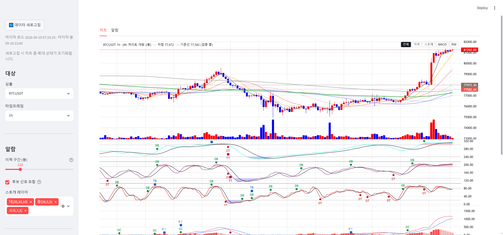
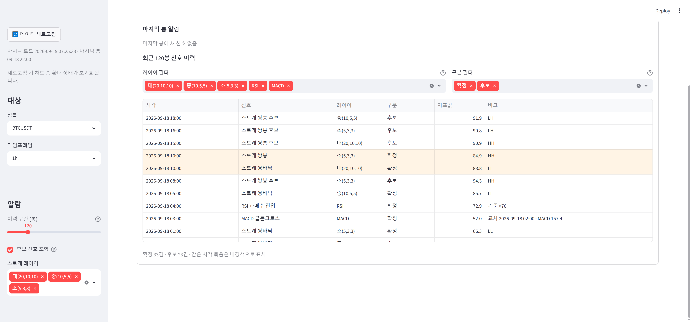

# signal-alarm 브랜치 — 알람 패널 탭 분리 + 알람 탭 정리 보고

작성 2026-09-19. 수정 파일: `main.py`(탭 구조), `display/alarm_panel.py`(이력 표 표시 정리), 테스트 1파일 신규.
알람·지표·게이트 정의 무접촉(analysis/·indicators/ 무수정), 차트 요소 무변경, 상충 신호 판정·병합·억제 로직 없음.
**적용하려면 실행 중인 Streamlit 재시작 필요**(main·display 모듈 변경). 검증은 별도 포트 8502 재시작으로 했다.

## 1. 커밋 (분리)

| 구분 | 해시 |
|---|---|
| 탭 구조 [차트] [알람] | 9c9a070 |
| 알람 탭 정리(필터·묶음 음영·컬럼 폭) + 테스트 5건 | f0d16fd |
| 보고·스크린샷 | (이 문서 커밋) |

## 2. 탭 구조 (§1)

- `st.tabs(("차트", "알람"))` — 첫 탭 = 차트(기본). 차트 탭: 현행 LW 차트 + 게이트 캡션 + 조작 캡션 그대로(Plotly 경로도 같은 탭).
  알람 탭: 알람 패널 전체(RSI 구역·마지막 봉·최근 N봉 요약, 마지막 봉 알람, 신호 이력 표). 사이드바 위젯 공통.
- **탭 전환 시 차트 줌 유지 — 실측 결과 유지된다(회피 조치 불필요).** `st.tabs` 는 비활성 탭 내용도 렌더하지만
  프론트에서 CSS 로 숨길 뿐 rerun·iframe 재생성이 없다.

| 단계 | LW 인스턴스 프로브 | 시간축 논리 범위 | 세로 줌 | pane 높이 | iframe |
|---|---|---|---|---|---|
| 차트 탭에서 줌·세로 줌·스토캐 단독 걸어둠 | `same-instance` | 857.3 ~ 995.4 | 74,027~81,406 | 14/969/14/14 | 폭 1450 |
| 알람 탭으로 전환 | `same-instance`(유지) | 857.3 ~ 995.4 | 유지 | 2/2/2/2 (숨김: 폭 0) | 숨김(display none) |
| 차트 탭 복귀 | `same-instance` | **857.3 ~ 995.4** | **유지** | **14/969/14/14** | 폭 1450 |

  프로브 = iframe 안 `window` 에 심은 값이 왕복 후에도 남아 있음 → 같은 JS 인스턴스. 숨김 중에는 autoSize 가 0 폭을 보지만
  복귀 시 LW 가 논리 범위·stretch 를 그대로 복원했다. 콘솔·페이지 에러 0.

## 3. 알람 탭 정리 (§2)

- **표시 필터** (이력 표 위, 두 열): `레이어 필터` 멀티선택(표에 실제로 있는 이름만, 대/중/소/RSI/MACD 순) ·
  `구분 필터`(확정/후보). **기본값 전체 선택 = 현행 표와 동일.** 빈 선택도 전체(사이드바 스토캐 레이어 선택과 같은 관례, help 에 명시).
  필터는 `signals_to_frame` 결과를 **표에서만** 거른다 — `recent_signals` 호출·상단 metric·마지막 봉 알람은 그대로.
  실측: 전체 56행 → 구분에서 '후보' 제거 → 33행, 캡션 "확정 33건 · 후보 0건".
- **같은 시각 묶음:** `signals_to_frame` 이 (시각, kind) 정렬의 역순을 내므로 같은 시각은 이미 인접해 있다 — 정렬은 손대지
  않았고, **같은 시각이 2건 이상인 묶음에 배경색**(pandas Styler, 인접 묶음은 `#FFF4E5`/`#EAF2FF` 교대)만 입혔다.
  스크린샷의 09-18 10:00 쌍봉(소)+쌍바닥(대) 행이 한 묶음으로 보인다. 판정·병합 없음(행 수·내용 불변).
- **컬럼 폭:** `column_config` 로 비고 `large`, 시각·신호 `medium`, 레이어·구분·지표값 `small`, `width="stretch"`.
  "교차 2026-09-18 02:00 · MACD 157.4" 가 잘리지 않고 전부 보인다(이전에는 우측 잘림).

| 차트 탭 | 알람 탭 (필터 · 10:00 묶음 음영 · 비고 전체 표시) |
|---|---|
|  |  |

## 4. 테스트

| 묶음 | 결과 |
|---|---|
| tests/test_alarm_tab_layout.py (신규 5건: 레이어 옵션 순서 / 필터 기본 전체·순서 유지 / 묶음 음영 2건 이상만·교대 / 컬럼 폭·병합 없음 / 탭 배선) + test_slim_app_smoke | 22 passed |
| 전체 tests/ | **662 passed, 2 failed, 1 skipped** — 실패 2건은 test_wave_ruleset_robustness (numpy2/pandas3 기존 회귀, 무관). 이전 657 → 662(신규 5) |

## 5. 한계 · 남은 것

- 필터 위젯은 key 없이 옵션 = 표의 레이어 집합이라, 심볼·TF 변경으로 레이어 집합이 바뀌면 새 위젯으로 잡혀 기본(전체)으로 돌아간다.
- 상충 여부(쌍봉·쌍바닥 동시)를 따로 판정하지 않으므로 같은 시각의 동방향 2건(예: RSI+스토캐 쌍바닥)도 같은 음영으로 묶인다 —
  지시대로 "같은 시각" 기준 표시 묶음이다.
- 사용자 Streamlit(8501)은 재시작 전까지 이전 화면(탭 없음).
