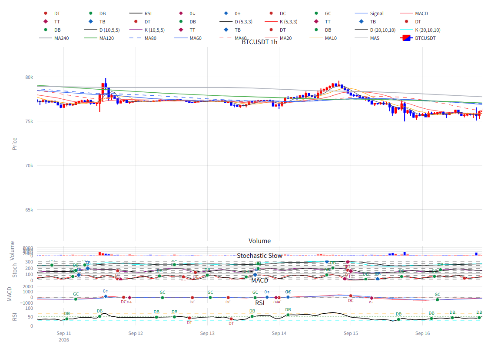
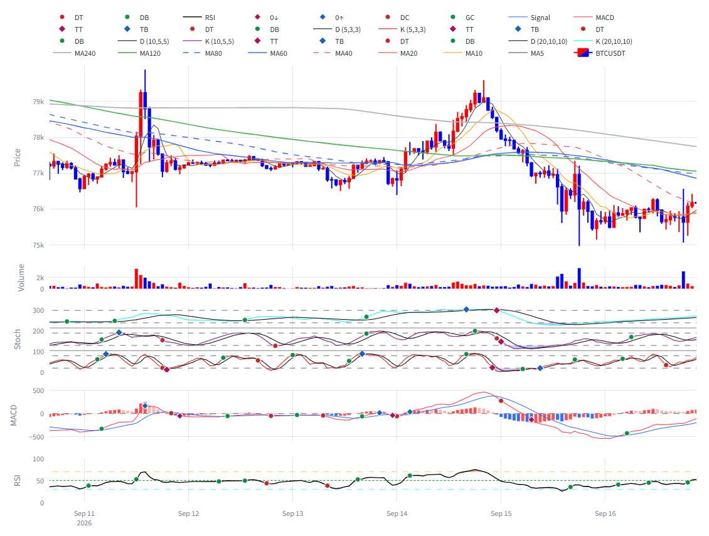

# signal-alarm 브랜치 — 차트 레이아웃 회귀 수정 보고 (직전 조작성 커밋 후속)

작성 2026-09-17. charts/display 전용, 지표·알람 로직 무접촉. **적용하려면 실행 중인 Streamlit 재시작 필요**(charts 모듈 상수·함수 구조가 바뀌어 핫리로드로는 안전하지 않음).

## 1. 커밋

| 구분 | 해시 |
|---|---|
| 수정 | 762431e |
| 테스트 | 4adc54f |
| 보고·스크린샷 | (이 문서 커밋) |

## 2. 항목별 처리

### 2.1 패널 비중
- 가격 0.75 고정 폐기. 표시 중인 패널 집합 기준 절대 비중: 가격 0.50 / 거래량 0.06 / 스토캐 0.18 / MACD 0.14 / RSI 0.12 (`PANEL_SHARES`). 꺼진 패널 비중은 가격이 흡수(예: MACD·RSI 끄면 가격 0.76). Separated 스토캐는 0.18 을 3층이 나눔.
- `vertical_spacing` 0.018 → 0.04.
- 최소 픽셀 규칙: 하위 패널의 실제 px = (전체 − 마진) × 비중 × (1 − 간격 합) 이 80 미만이면 전체 높이를 올려 잡는다(`_effective_chart_height`). **해석 한 가지**: 거래량은 예외로 두었다. 0.06 비중에 80px 를 요구하면 어떤 선택값이든 차트가 1333px 이상이 되어 높이 셀렉트가 무의미해진다. 거래량은 얇은 막대 스트립이라 판독 대상이 아니라고 보았다.
- 결과(5패널, Stacked): 선택 600 → 854px, 800 → 854px, 1000 → 1000px. RSI(0.12)가 80px 를 만족하려면 854px 가 필요하다. Separated(7행)는 층당 0.06 이라 약 1.8k px 로 올라간다.

### 2.2 패널 제목
`subplot_titles` 제거 → annotation 0개(테스트로 고정). 심볼·TF 는 상단 알람 헤더가 이미 보여준다. 상단 마진 45 → 30.

### 2.3 가격 y 자동범위 — 진단·수정
- **진단(before, 브라우저 `_fullLayout` 읽음)**: 가격 yaxis autorange=true, range **61,437 ~ 83,398** 인데 x 범위는 최근 150봉(09-10~09-16, 실제 가격 약 74.9k~80k). 고정 range 잔존 아님, uirevision 미설정(이전 줌 유지 아님), 숨은 트레이스 아님. **원인: Plotly autorange 는 x 범위를 무시하고 전체 적재 데이터(1000봉)로 y 를 잡는다.**
- **수정**: `_fit_yaxes_to_window` — 가격(저가·고가·표시 MA)·거래량(0~max×1.05)·MACD(macd/signal/hist) 를 최근 RECENT_WINDOW(150) 봉 값으로 range 명시(autorange=False). 스토캐·RSI 는 고정 스케일이라 대상 아님. 더블클릭(reset)은 이 초기 range 로 돌아온다.
- **uirevision**: `f"{symbol}|{interval}"` — 재실행 사이 줌·이동 유지, 심볼·TF 전환 시 리셋(테스트로 고정).
- after 측정: 가격 range 74,870 ~ 79,988, 창 안 저가·고가 대비 2% 여백.

### 2.4 하위 패널 가독성
- 스토캐: 레이어당 참조선 20/80 두 줄만(50 제거), 스택 패널 y 그리드 끔. Separated 도 20/80 만.
- 거래량: `nticks=3`, `tickformat="~s"`, `rangemode="tozero"`. before/after 모두 음수 눈금 없음(before 눈금 0/2000/4000/6000/8000, after 0/2k). 음수 눈금은 관측되지 않았다 — 막대 트레이스라 autorange 가 0 에서 시작했고, 이제는 명시 range [0, max×1.05] 라 구조적으로 불가.
- 마커: 하위 패널(스토캐 DB/DT/TB/TT, RSI DB/DT, MACD GC/DC/0↑/0↓) 텍스트 숨김 → 마커+호버 템플릿(`show_text=False`). after 에서 텍스트 트레이스 0개. 가격 패널 MA 패턴 마커(`add_ma_pattern_markers`)는 텍스트 유지.

## 3. 검증

### 스크린샷 (BTC 1h, 패널 5개 전부 켬, 높이 800 선택, 1600px 뷰포트)

| before | after |
|---|---|
|  |  |

확인 항목:
- 제목 겹침: before "Volume/Stochastic Slow/MACD/RSI" 제목이 패널 위로 겹침 → after 제목 없음.
- 하위 패널 선 판독: before 스토캐·MACD·RSI 각 ~46px 에 라벨 수십 개 → after 스토캐 129px·MACD 100px·RSI 86px, 라벨 없음, 3층 K/D 선과 MACD 막대·선이 구분됨.
- 가격 y 밀착: before 61k~83k(데이터 75k~80k) → after 74.9k~80.0k.
- 거래량 눈금: before 5개 겹침 → after 0/2k 두 개, 음수 없음.

### 테스트
| 묶음 | 결과 |
|---|---|
| tests/test_slim_app_smoke.py (신규 2건 포함) | 13 passed |
| tests/test_alarm_signals.py | 21 passed |
| tests/test_code_version.py | 4 passed |
| tests/test_panel_smoke.py (레거시 어댑터 경로) | 3 passed, 1 skipped |

## 4. 남은 한계
- x 줌·이동 후 y 가 새 창에 자동 밀착하지는 않는다(초기 렌더만 밀착). 직전 보고와 동일한 Plotly 한계(렌더 엔진 사안).
- 스토캐 스택은 3층 × 20/80 = 6줄이 여전히 가로로 깔린다. 층당 두 줄이 위임 스펙이라 유지.
