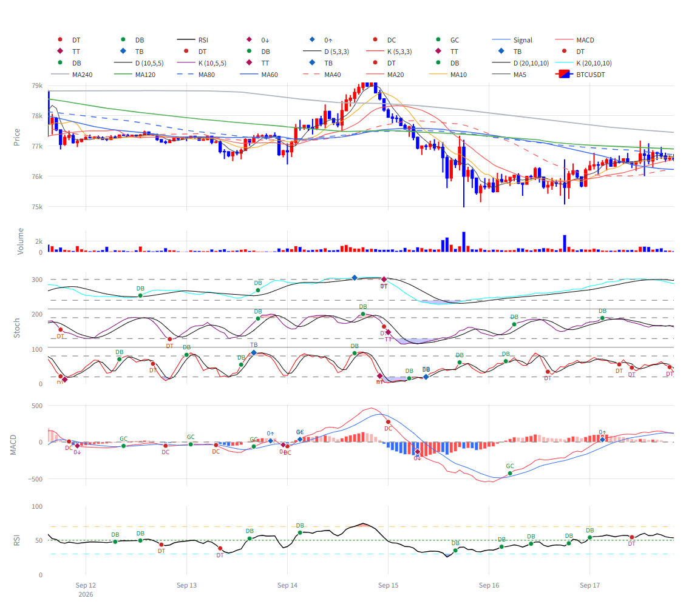

# signal-alarm 브랜치 — 하위 지표 패널 확대 보고 (비중 재배분 + 높이 옵션 확장)

작성 2026-09-18. charts/display 전용, 지표·알람 로직 무접촉. **적용하려면 실행 중인 Streamlit 재시작 필요**
(charts 모듈 상수·함수 시그니처와 main 사이드바 위젯이 바뀌어 핫리로드로는 안전하지 않음. 8501 에서 돌고
있던 인스턴스는 이전 코드 상태이며 검증은 별도 포트 8502 인스턴스로 했다).

## 1. 커밋

| 구분 | 해시 |
|---|---|
| 수정 (charts/plotly_builder.py · main.py) | 4dd7468 |
| 테스트 (tests/test_slim_app_smoke.py) | 356c457 |
| 보고·스크린샷 | (이 문서 커밋) |

## 2. 항목별 처리

### 2.1 표시 모드 2종 (사이드바 라디오 "표시 모드", 기본 = 지표 중심)

| 모드 | 가격 | 거래량 | 스토캐 | MACD | RSI | 하위 3패널 합 |
|---|---:|---:|---:|---:|---:|---:|
| 기본형 (현행) | 0.50 | 0.06 | 0.18 | 0.14 | 0.12 | 0.44 |
| 지표 중심 (신규, 기본) | 0.34 | 0.05 | 0.26 | 0.19 | 0.16 | 0.61 |

- `PANEL_SHARES_BY_MODE` 로 비중 세트만 갈아 끼운다. `_row_heights(rows, layout_mode)` 가 세트를 고르고,
  꺼진 패널 흡수(가격이 가져감)·80px 최소 규칙(`_effective_chart_height`)·간격 0.04 는 기존 로직을 두 모드에
  공통 적용. Separated 스토캐는 각 모드의 스토캐 비중을 3층이 나눈다.
- `PANEL_SHARES` 는 기본형 세트의 별칭으로 남겼다(하위 호환).
- main.py: 라디오 값은 모드 키(`indicator`/`basic`), 표시는 `LAYOUT_MODE_LABELS`("지표 중심"/"기본형"),
  `render_chart(..., layout_mode=...)` 로 전달.

### 2.2 높이 옵션 확장

`CHART_HEIGHT_OPTIONS = (600, 800, 1000, 1200)`, 기본 1000.

**실측 (5패널 Stacked, 공식 = (전체 − 마진 60) × 비중 × (1 − 0.04×4)).** 브라우저 `_fullLayout` 의 y축
도메인 × 플롯 높이로 재확인한 값과 소수 첫째 자리까지 일치했다(지표 중심 + 1000 행).

| 모드 | 선택 | 실제 전체 | 가격 | 거래량 | 스토캐 | MACD | RSI |
|---|---:|---:|---:|---:|---:|---:|---:|
| 지표 중심 | 600 | 656 ↑ | 170 | 25 | 130 | 95 | 80 |
| 지표 중심 | 800 | 800 | 211 | 31 | 162 | 118 | 100 |
| **지표 중심** | **1000** | **1000** | **268.5** | **39.5** | **205.3** | **150.0** | **126.3** |
| 지표 중심 | 1200 | 1200 | 326 | 48 | 249 | 182 | 153 |
| 기본형 | 600 | 854 ↑ | 334 | 40 | 120 | 93 | 80 |
| 기본형 | 800 | 854 ↑ | 334 | 40 | 120 | 93 | 80 |
| 기본형 | 1000 | 1000 | 395 | 47 | 142 | 111 | 95 |
| 기본형 | 1200 | 1200 | 479 | 58 | 172 | 134 | 115 |

(↑ = RSI 80px 최소 규칙으로 전체 높이가 올라간 경우.)

**위임장 기대치(스토캐 ~260 / MACD ~190 / RSI ~160)와의 차이.** 실측은 205 / 150 / 126 이다. 기대치는
0.26×1000 = 260, 0.19×1000 = 190, 0.16×1000 = 160 과 정확히 일치하므로, 마진 60px 과 패널 간격(0.04×4 =
플롯의 16%)을 빼기 전 값이다. 비중은 위임 수치를 그대로 썼고 공식은 바꾸지 않았다. 기대치 수준(≈260/190/160)이
필요하면 두 가지 중 하나다 — (a) 지표 중심 + **1200** 선택(249 / 182 / 153), (b) 비중을 더 옮기거나 간격을
줄이는 재배분. 어느 쪽도 위임 범위 밖이라 하지 않았다.

### 2.3 확대에 따른 정리

- **하위 패널 마커 텍스트 라벨**: `SUBPANEL_MARKER_TEXT_BY_MODE` — 지표 중심 = 표시(`markers+text`), 기본형 =
  숨김(`markers`) 유지. 대상은 스토캐 DB/DT/TB/TT(Stacked·Separated 모두), RSI DB/DT, MACD GC/DC/0↑/0↓.
  마커 트레이스 수는 모드와 무관(텍스트만 켜고 끔). 가격 패널 MA 패턴 마커는 원래 텍스트 유지.
  스크린샷에서 라벨 판독 가능. 겹치는 곳은 같은 봉에 두 이벤트가 동시에 뜬 지점(예: MACD 0↑ 와 GC, 스토캐
  DT 와 TT)뿐이며 패널 크기와 무관한 이벤트 동시 발생이다.
- **스토캐 3층 레이어 겹침 점검**: y 0~320 에 참조선 6(층당 20/80) + 분리선 2. 인접 수평선 최소 간격은
  분리선~참조선 25단위. 지표 중심 + 1000 에서 스토캐 패널 205.3px → 0.64 px/단위 → **최소 16.0px**
  (참조선 20~80 사이 38.5px, 층 간격 10단위 6.4px). 겹치지 않으므로 **참조선 투명도는 손대지 않았다**.
  구조(오프셋 0/110/220, 참조선 수, 분리선 수)는 그대로이며 테스트로 고정.

## 3. 검증

### 스크린샷 — BTC 1h, 5패널 전부 켬, 지표 중심 + 1000, 뷰포트 1600px

전체 페이지(사이드바 포함): `img/chart_panel_expand_indicator_1000_full.png`. 사이드바 기본 선택이
"지표 중심"·"1000" 임을 페이지에서 읽어 확인했다(라디오 체크 상태·셀렉트 값).

### 테스트

| 묶음 | 결과 |
|---|---|
| tests/test_slim_app_smoke.py (기존 4건 갱신 + 신규 4건) · test_alarm_signals.py · test_code_version.py · test_panel_smoke.py | 45 passed, 1 skipped |
| 전체 tests/ | 613 passed, 2 failed, 1 skipped — 실패 2건은 test_wave_ruleset_robustness (numpy2/pandas3 기존 회귀, 이번 변경과 무관) |

신규 테스트: 모드별 비중·합계 0.44→0.61·Separated 3등분·꺼진 패널 흡수 / 지표 중심 1000 하위 패널 px
(≥200·≥145·≥120, 모든 높이에서 기본형보다 큼) / 마커 텍스트 모드 종속(스토캐 y3·MACD y4·RSI y5, Separated
포함, 트레이스 수 불변) / 스토캐 참조선 최소 간격 ≥12px·참조선 수 불변.

## 4. 남은 한계

- 위임 기대치와 실측의 차이(§2.2) — 비중을 그대로 둘지, 1200 을 기본으로 할지, 재배분할지는 결정 사항.
- 라벨 동시 발생 겹침(§2.3)은 패널을 키워도 남는다. 필요하면 textposition 을 이벤트 종류별로 엇갈리게 두는
  방법이 있으나 이번 범위 밖.
- 600 선택은 두 모드 모두 80px 규칙으로 올라간다(지표 중심 656, 기본형 854).
- x 줌·이동 후 y 자동 밀착 없음(직전 보고와 동일한 Plotly 한계).
