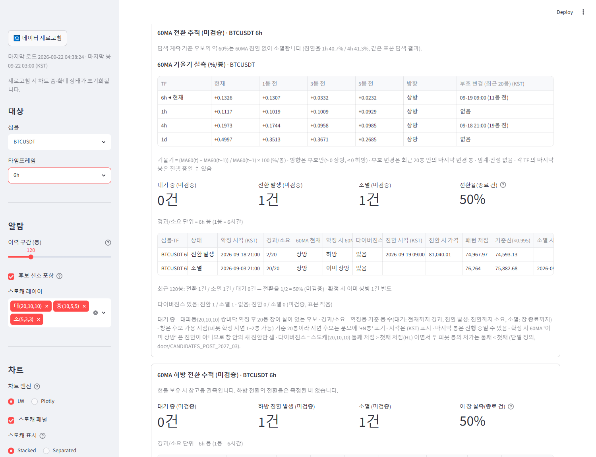
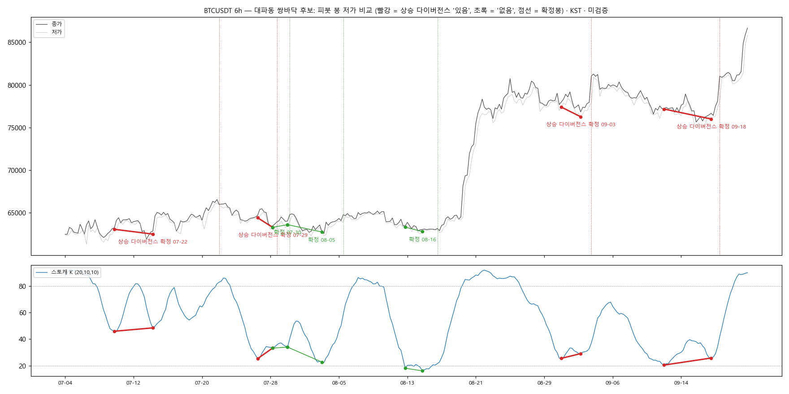
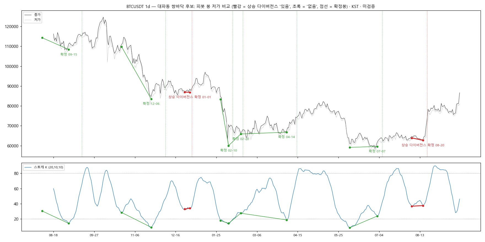

# 다이버전스 정의 고정 + 표시 + 전방 자동 기록 — 보고

작성 2026-09-22. 정의 파일(analysis/·indicators/·config/)·전방 추적 파일(scripts/·validation/ 추적 산출물) 무접촉. `.github/workflows/notify_scan.yml` 무수정.
**적용하려면 실행 중인 Streamlit(8501) 재시작 필요**(display 모듈 변경). 검증은 8502 재시작으로 했다(종료함).

## 1. 커밋 (단계별)

| 단계 | 내용 | 브랜치 | 해시 |
|---|---|---|---|
| A | docs/CANDIDATES_POST_2027_03 "다이버전스 플래그의 단일 정의" 절에 **정의 고정** 소절 추가 (추적 클론에서 커밋·푸시) | main | `870f025` — **origin/main 도착 확인**(`git fetch` 후 origin/main == 870f025) |
| B | `display/divergence_flag.py` 신설 + 60MA 전환 추적 표 '다이버전스' 열 + 코호트 집계 줄 + 테스트 | signal-alarm | `7f10312` |
| B' | divergence_flag 의 probe import 부작용(logging/warnings 꺼짐) 복구 — 스캐너 로그 소실 회귀 수정 | signal-alarm | `6e4a6d5` |
| B | 보고·스크린샷·대조 차트 | signal-alarm | (이 문서 커밋) |
| C | 후보 알림 `stoch_db` + 60MA 전환 알림 다이버전스 줄 + 전방 ledger(1h·4h·6h·1d) + 테스트 35건 | main | `a95b99c` (푸시 완료, 추적 클론 동기화 완료) |

signal-alarm 은 여전히 미푸시. main 의 매니페스트 테스트는 `git show 6e4a6d5:display/divergence_flag.py` 로 blob 대조(원격에 없으면 그 대조만 skip, sha256 대조는 항상).

## 2. 정의 (단계 A 그대로, 코드가 소비하는 것)

`display/divergence_flag.py::divergence_flags(pipe, sig)` — 확정봉 위치 → 있음/없음:
- (1) 스토캐 저점: 기존 검출기가 **확정봉에 기록한** `stoch_db_kind_(20,10,10)` == `"HL"` (검출기는 첫·둘째 바닥의 스토캐 값으로 kind 를 매긴다).
- (2) 가격 저점: 첫 피봇 = 검출기 기록 `stoch_db_first_pos`, 둘째 피봇 = 확정봉 이하 마지막 스토캐 피봇 저점 — 계측 스크립트 `probe.extract_signals` 의 후보 `p1`·`p2` 그대로. `low[p2] < low[p1]`.
- 새 파라미터 없음. 재구현 없음(테스트가 `compute_*_pivots`·`detect_double_bottom`·`nanmin`·`min()` 등 부재 단언, 파이프라인에서 검출기 kind·probe 피봇과의 일치를 값으로 확인).
- 테스트가 정의 문서(870f025)의 문구 — "(20,10,10)", "`stoch_db_kind` = HL", "피봇 봉의 저가", "두 번째 < 첫 번째" — 를 대조한다.

주의(정의 그대로 두고 보고만): 둘째 피봇을 "확정봉 이하 마지막 피봇 저점" 으로 잡는 것은 probe 와 동일한 규칙이다. 검출기 내부의 `second_bottom_pos` 는 컬럼으로 기록되지 않아 그것을 쓰려면 정의 파일을 건드려야 한다. 합성 1,600봉에서는 두 규칙이 어긋난 사례가 없었다(테스트 `p2 ≤ c` 이고 `(p2, c]` 에 피봇 없음).

## 3. 단계 B — 화면

- 60MA 전환 추적 표에 **'다이버전스' 열**(확정 시 60MA 뒤, 있음/없음). 하방 추적 표는 변경 없음.
- 집계 줄: "다이버전스 있음: 전환 X / 소멸 Y · 없음: 전환 X / 소멸 Y (미검증, 표본 적음)" — 표 아래 캡션, `build_lines` 마지막 줄.
- 캡션 설명에 정의 한 줄 추가. 차트·알람 배지 무변경.



### 트레이딩뷰 대조 — **캡처 미수령, 대조 자료만 준비**

이 PC 에서 사용자 캡처(트레이딩뷰 '상승' 표시)를 찾지 못했다(Desktop·Downloads·Pictures·docs 최근 4일 이미지 전수 확인 — 앱 자체 스크린샷뿐).
따라서 시각 대조는 **미수행**이며, 대조에 필요한 앱 쪽 자료를 아래에 둔다. 캡처를 받으면 그대로 맞춰 보고 어긋난 건별로 원인을 적겠다(정의는 바꾸지 않는다).

앱이 '있음' 으로 표시한 후보 — BTCUSDT 6h (최근 320봉 = 2026-07-04~09-22 KST):

| 확정(KST) | 첫 피봇(KST) 저가 · K | 둘째 피봇(KST) 저가 · K | 스토캐 | 가격 | 판정 |
|---|---|---|---|---|---|
| 07-22 09:00 | 07-10 03:00 63,061 · 46.0 | 07-14 15:00 62,500 · 48.5 | HL | LL | **있음** |
| 07-29 03:00 | 07-26 21:00 64,414 · 25.3 | 07-28 15:00 63,294 · 33.3 | HL | LL | **있음** |
| 07-30 15:00 | 07-28 15:00 63,294 · 33.3 | 07-30 09:00 63,604 · 34.0 | HL | HL | 없음 |
| 08-05 21:00 | 07-30 09:00 63,604 · 34.0 | 08-03 09:00 62,751 · 22.8 | LL | LL | 없음 |
| 08-16 21:00 | 08-13 03:00 63,310 · 18.1 | 08-15 03:00 62,800 · 16.1 | LL | LL | 없음 |
| 09-03 21:00 | 08-31 09:00 77,392 · 25.6 | 09-02 15:00 76,264 · 29.1 | HL | LL | **있음** |
| 09-18 21:00 | 09-12 09:00 77,164 · 20.5 | 09-17 21:00 76,000 · 25.8 | HL | LL | **있음** |

BTCUSDT 1d (최근 400봉 = 2025-08-18~2026-09-21): '있음' 2건 — 확정 2026-01-01(피봇 12-25 86,935 · K 33.0 → 12-30 86,846 · K 34.1), 확정 2026-08-20(피봇 08-05 63,880 · K 36.7 → 08-16 62,716 · K 37.5). 없음 6건(09-15·12-06·02-10·02-20·04-14·07-07).

| BTCUSDT 6h | BTCUSDT 1d |
|---|---|
|  |  |

대조 시 어긋날 수 있는 원인(예상, 확인 전):
1. **표시 시점 차이** — 트레이딩뷰 스크립트는 보통 둘째 피봇 + 우측 확인 봉(lbR)에 표시하지만, 앱의 '확정' 은 넥라인 돌파봉이라 훨씬 늦다(6h 07-22 건: 둘째 피봇 07-14 → 확정 07-22, 8일). 위치는 피봇으로 맞춰 봐야 한다.
2. **피봇 정의 차이** — 앱은 스토캐 K 피봇(lookback 2·min_gap 4·min_delta 4, 기존 검출기)인데 TV 스크립트는 lbL/lbR(흔히 5/5)·피봇 간 거리 제한을 쓴다. 앱이 잡는 얕은 저점(K 46→48, 6h 07-22 건)이나 5봉 간격 저점(1d 01-01 건, 저가 차 −0.1%)은 TV 에 없을 수 있다.
3. **피봇 연쇄** — 앱은 한 피봇을 앞 후보의 둘째·뒤 후보의 첫째로 두 번 쓴다(6h 07-28 15:00). TV 는 보통 마지막 피봇 쌍만 본다.
4. **가격 비교 봉** — 앱은 피봇 봉의 저가(정의). TV 스크립트도 대개 같지만 종가 비교 옵션이 있는 스크립트가 있다.
5. **과매도 조건 없음** — 정의에는 K 구역 조건이 없다(6h 07-22 건 K 46~48). TV 스크립트 중에는 과매도 구역 필터가 있는 것이 있다.

## 4. 단계 C — 알림 + 전방 ledger (main a95b99c)

### C-1 후보 알림 `stoch_db` "대파동 쌍바닥 후보 (미검증)"
- 대상 9셀(1h·4h·1d), 닫힌 봉만. `track_candidates` 의 후보 행 전부(키 = 확정봉; 알 수 있게 된 봉 = 가용 시점 known_pos).
- 메시지(테스트 고정, 위임 예시 그대로):
  ```
  [BTCUSDT 4h] 대파동 쌍바닥 후보 (미검증)
  ★ 상승 다이버전스                       ← 해당 시에만
  확정 09-21 13:00 · 60MA 현재 하방 (전환 대기, 창 20봉)
  패턴 저점 74,968 / 기준선 74,593
  참고: 과거 계측상 후보의 약 60%는 60MA 전환 없이 소멸
  ```
  3행은 상태에 따라: 확정 시 이미 상방 → "60MA 이미 상방"(발송함) · 스캔 시점에 이미 전환 → "60MA 전환 발생 mm-dd hh:mm (소요 N봉)" · 창 종료 → "소멸 (창 20봉 안 60MA 전환 없음)". (Actions 가 하루 3회 정도만 도는 현 상황에서는 확정 뒤 몇 봉 지나 스캔되는 일이 흔해 상태 표기가 필요했다.)
- **신규 종류 첫 스캔 = 발송 0건·전량 기록** 규칙(0481739, 종류별 `kinds`)이 그대로 적용된다 — 첫 라이브 실행에서 20일 창의 후보(§5 빈도 기준 9셀 ≈ 35건)는 기록만. 테스트로 고정(`test_new_kind_first_run_*`, 종류 무관).
- 기존 60MA 전환 알림은 3줄 유지 + 끝에 "다이버전스 있음/없음" 1줄.
- 권고 어휘 금지 목록(매수·진입·매도·숏·청산) 부재를 후보 메시지 포함 전 종류에 단언.

### C-2 전방 ledger (알림과 별개)
- 후보 생애주기 종료(전환 발생/소멸) 시 한 줄: `symbol, tf, confirm_ts, divergence, result(turned/expired), bars_to_turn, turn_ts, turn_price, pattern_low, already_up, recorded_at`.
- 대상 3심볼 × **1h·4h·6h·1d** — 6h 는 fetch·기록만(알림 이벤트 0, 로그에 "(ledger only)").
- **과거 소급 금지**: ledger 가 처음 만들어진 실행에서 `since = now` 를 적고, 확정봉 open_time ≥ since 인 후보만 추가(첫 실행 추가 0행 — 실데이터 테스트로 고정). 중복 없음, 30일 회전과 무관.
- **저장 위치 = `notify/sent.json` 안의 `"ledger"` 필드**(notify-state 브랜치). 워크플로가 `git add notify/sent.json` 만 하므로 워크플로 무수정 제약 아래서는 이 파일이 유일한 영속 경로다. CSV 는 `python -m notify.scanner --state <sent.json> --export-ledger ledger.csv` 로 내보낸다(테스트 있음). 파일 크기: 12셀 합 ≈ 2건/일 → 연 700행 정도.
- 기존 이력 파일(`ledger` 필드 없음)은 `{"since": None, "rows": []}` 로 읽혀 첫 실행에서 since 가 잡힌다(라이브 notify-state 파일로 load 확인).

### 검수
- `tests/test_notify_scanner.py` 35건 통과. 전체 스위트(main 워크트리) **700 통과 / 2 실패 / 1 스킵** — 실패 2건은 기존 `test_align_gate_6h_coverage`(추적 사이드카 상태, 이 라운드 이전부터·무관).
- dry-run(실데이터): 로그 정상, 6h 셀 "ledger only", "ledger started: since=…", "eligible(after since)=0".
- Actions: 보고 시점(05:08 KST)까지 새 main 으로 돈 스케줄 실행 없음(마지막 09-21 16:29 UTC). 첫 실행에서 `stoch_db` 는 record-only, ledger 는 since 만 기록될 것.

## 5. 알림 빈도 추정 — 최근 90일 (2026-06-23 ~ 09-21, 셀별 후보 확정 건수)

| 셀 | 후보(90일) | 후보/일 | 다이버전스 | 비율 |
|---|---|---|---|---|
| BTCUSDT 1h | 41 | 0.456 | 12 | 29% |
| ETHUSDT 1h | 38 | 0.422 | 19 | 50% |
| BNBUSDT 1h | 36 | 0.400 | 14 | 39% |
| BTCUSDT 4h | 13 | 0.144 | 6 | 46% |
| ETHUSDT 4h | 9 | 0.100 | 2 | 22% |
| BNBUSDT 4h | 10 | 0.111 | 3 | 30% |
| BTCUSDT 1d | 2 | 0.022 | 1 | 50% |
| ETHUSDT 1d | 2 | 0.022 | 0 | 0% |
| BNBUSDT 1d | 2 | 0.022 | 0 | 0% |
| **알림 9셀 합** | **153** | **≈1.70건/일** | 57 | **37%** |
| BTCUSDT 6h (ledger 전용) | 10 | 0.111 | 5 | 50% |
| ETHUSDT 6h (ledger 전용) | 5 | 0.056 | 0 | 0% |
| BNBUSDT 6h (ledger 전용) | 9 | 0.100 | 3 | 33% |
| ledger 12셀 합 | 177 | ≈1.97건/일 | 65 | 37% |

→ 후보 알림은 **하루 약 1.7건(주 12건)**, 그중 1h 가 1.28건/일로 75%. 다이버전스 '있음' 비율은 전체 37%(셀별 22~50%, 1d 는 표본 2건). ledger 는 후보당 1행이 생애 종료 시 추가되므로 같은 속도(≈2행/일)로 쌓인다.
기존 알림(60MA 전환 0.72/일 + 하방 전환 0.65/일 + 구조 LL)까지 합치면 텔레그램 하루 3건 이상 — 1h 후보 알림을 뺄지는 김박사 결정(뺀다면 `TFS` 가 아니라 `stoch_db` 종류의 TF 필터 1줄).

## 6. 한계·남은 결정
- 트레이딩뷰 캡처 대조 미수행(캡처 없음) — §3 자료로 대조 요청.
- 후보 알림 빈도(1.7/일)가 기존 알림의 두 배 이상 — 유지/축소 결정.
- ledger 가 sent.json 안에 있으므로 별도 파일로 빼려면 워크플로의 `git add` 한 줄 수정이 필요하다(현재 금지).
- 앱의 main 판 `display/ma60_turn_tracker.py`(9bb606c)는 그대로 — '다이버전스' 열은 signal-alarm 표시 전용이고 스캐너는 `divergence_flag` 를 직접 쓴다(같은 함수).
