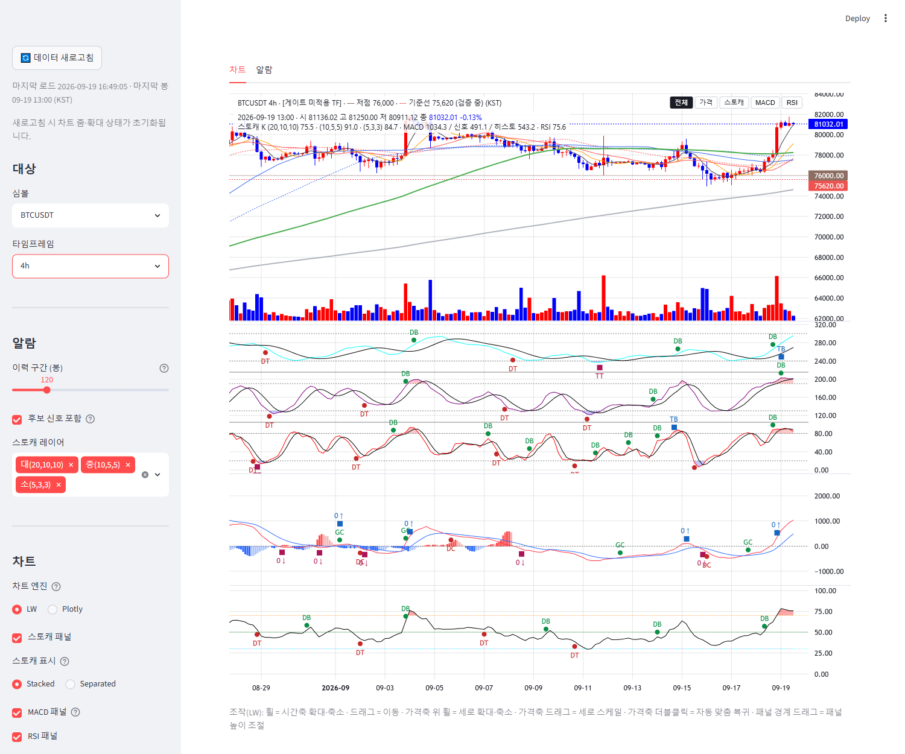

# signal-alarm 브랜치 — 화면 시각 KST 표시 (표시 계층 한정) 보고

작성 2026-09-19. **데이터·계산·기록은 naive UTC 그대로**(프레임 인덱스·검출기 입력·사이드카·저널). 변환은 렌더 직전 1회,
`display/tz_label.to_kst` 로만. 사이드카·저널·계측 산출물·알람 정의·게이트 asof 로직 무접촉(analysis/·indicators/·data/·config/ 무수정 — 테스트로 고정).
**적용하려면 실행 중인 Streamlit 재시작 필요**(charts·display·main 모듈 변경). 검증은 별도 포트 8502 재시작으로 했다.

## 1. 커밋 (분리)

| 구분 | 해시 |
|---|---|
| 헬퍼 `display/tz_label.py`: `to_kst`(+9h, DST 없음)·`kst_text`·`KST_LABEL` + 테스트 | 6d637f3 |
| 차트(LW): PAYLOAD time 표시 시프트 + 캡션 "(KST)" | 5c9adf1 |
| 패널: 알람 탭(마지막 봉·이력 표·비고)·60MA 추적 섹션·사이드바 + `UTC_LABEL` 제거 | c47a035 |
| 보고·스크린샷 | (이 문서 커밋) |

## 2. 원칙 준수 (§1)

- **인덱스·검출기·기록 무변환**: `to_kst` 는 naive→naive(+9h) 로 tz 객체를 붙이지 않으며, 표시용 문자열·표 사본·PAYLOAD 를 만들 때만 호출된다.
  `track_candidates`(60MA 추적)·`signals_to_frame`(알람 정의) 출력은 UTC 그대로이고 표시 사본만 변환(테스트가 원본 불변을 단언).
- **공용 헬퍼 1곳**: 차트 `_display_seconds` = `_unix_seconds(to_kst(ts))`, 알람 탭 `build_bar_caption`/`history_frame_kst`, 추적 `_fmt_ts`/`build_lines`,
  사이드바 `data_freshness_caption` — 전부 `display.tz_label` 만 import.
- **차트 방식(보고 요청)**: **시간축 자체는 옮기지 않고 PAYLOAD 의 time 을 +9h 시프트**한 뒤 라벨을 KST 로 붙이는 방식을 택했다.
  LW 는 시간대 개념이 없고 epoch 를 UTC 벽시계로 그리므로, 시프트한 epoch 를 넘기는 것이 LW 공식 권장 방식이다. 눈금 단계·밀도·포맷터는
  이전 커밋 그대로(한국식 순서). 캔들·이평·하위 pane·마커·크로스헤어 오버레이가 모두 같은 `times` 목록을 쓰므로 시프트가 한 곳(`_normalize`)에서 끝난다.

## 3. 적용 범위 (§2) — 전부 "(KST)" 표기, `UTC_LABEL` 사용처 0

| 지점 | 표시 |
|---|---|
| LW 툴팁·시간축 눈금·오버레이 | 시프트된 epoch → `2026-09-19 13:00`(4h 마지막 봉 = UTC 04:00) |
| LW 캡션 끝 | `… (검증 중) (KST)` |
| 알람 탭 마지막 봉 | 메트릭 `마지막 봉 (KST)` · 캡션 `마지막 봉 2026-09-19 14:00 (KST) (미확정 가능) …` |
| 알람 탭 신호 이력 표 | 헤더 `시각 (KST)`, 값 KST. **비고 안의 교차 시각 문자열**(정의 계층이 만든 "교차 2026-09-18 08:00 …")도 표시 사본에서 `kst_text` 로 KST 치환 — 표 안 시각이 한 시간대로 맞도록 |
| 60MA 추적 섹션 | 확정/전환/소멸 시각 열 헤더 `… (KST)`, 값 KST, 텍스트 요약 KST, 캡션에 "시각은 (KST) 표시" |
| 사이드바 | `마지막 로드 2026-09-19 16:49:05 · 마지막 봉 09-19 16:00 (KST)` — 로드 시각도 `time.localtime` 대신 epoch→`to_kst` 로(머신 시간대 비의존) |

## 4. 봉 경계 부작용 (§1 보고 항목)

- **1h 이하**: 봉이 정시에 열리므로 KST 로도 정시 — 부작용 없음.
- **4h**: UTC 00/04/08/12/16/20 시 봉이 KST 09/13/17/21/01/05 시가 된다. KST 자정에 열리는 봉이 없어 LW 의 **일 단위 눈금(`09-19` 등)은
  그 날 첫 봉인 01:00 봉에 붙는다**(스크린샷 §5 하단 눈금). 데이터 경계는 그대로이며 라벨만 KST 기준 — 시각적 위화감은 작지만 사실로 기록.
- **6h/8h/12h**: 같은 성격(예: 12h → KST 09:00·21:00 봉, 일 눈금은 09:00 봉에).
- **일봉 이상**: 봉 시각이 UTC 00:00 = KST 09:00. 툴팁은 일봉 이상에서 시:분을 생략하므로 날짜는 그대로(`2026-09-19`) — 날짜가 밀리지 않는다.
  다만 크로스헤어 오버레이 1줄째도 같은 포맷터라 일봉은 날짜만 보인다.
- 요약: **날짜가 어긋나는 경우는 없고**, 4h 이상 TF 에서 "일 눈금이 KST 자정이 아니라 그 날 첫 봉(01:00/09:00)에 찍힌다" 는 표시 특성만 있다. 조치 없음.

## 5. 스크린샷 (검증 인스턴스 8502, 2026-09-19 16:49 KST)

BTCUSDT 4h — 사이드바 `마지막 봉 09-19 13:00 (KST)`(= UTC 04:00), 캡션 끝 `(KST)`, 오버레이 `2026-09-19 13:00 …`, 시간축 눈금 `2026-09 · 09-03 … 09-19`.

## 6. 테스트 (§3)

- `tests/test_tz_label.py` 11건: `to_kst` 가 연중 7개 날짜에서 정확히 +9h 이고 `zoneinfo("Asia/Seoul")` 변환과 일치(DST 없음), naive 유지, aware/NaT 처리,
  `kst_text` 치환(날짜 넘어감 포함), **기록·정의 계층(analysis/indicators/data/config) 전 파일에 `display.tz_label`·`to_kst`·`tz_convert(`·`Asia/Seoul`·`KST` 부재**
  (사이드카 `wave_align_gate_forward.py`·저널 `wave_live_forward_journal.py`·알람 정의 `alarm_signals.py` 존재 확인 포함),
  전 표시 지점이 같은 KST 벽시계(차트 시프트 값 = 헬퍼, 알람 마지막 봉, 이력 표·비고, 추적 섹션, 사이드바)이며 원본 프레임은 UTC 불변, `UTC_LABEL` 잔존 없음.
- 기존 "변환 코드 부재" 검사는 **표시 계층을 제외하고 기록·정의 계층 한정**으로 바꿨다(위임 §3).
- `tests/test_lw_time_format.py`: 차트 툴팁이 KST(`2026-09-19 14:00`)임을 node 실행으로 확인; `tests/test_lw_builder.py`: PAYLOAD 시프트 값·인덱스 불변·마커 동일 시프트.
- 기존 LW·알람·추적·새로고침 테스트 포함 표시 계층 128건 통과.

## 7. 재시작

- 사용자 Streamlit(8501)은 재시작 전까지 이전 표기(UTC). 검증용 8502 는 종료했다.
