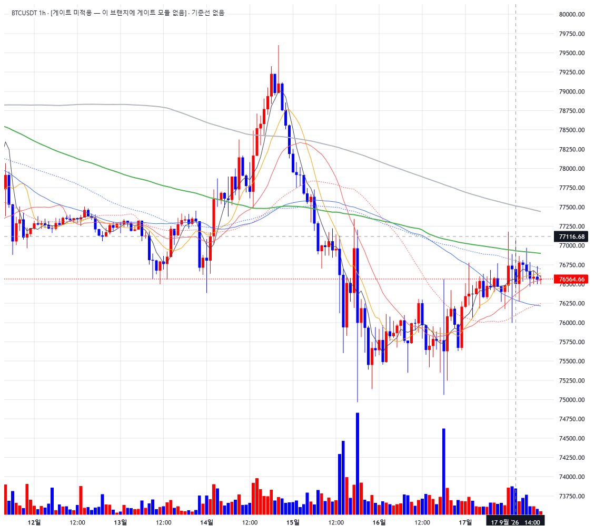
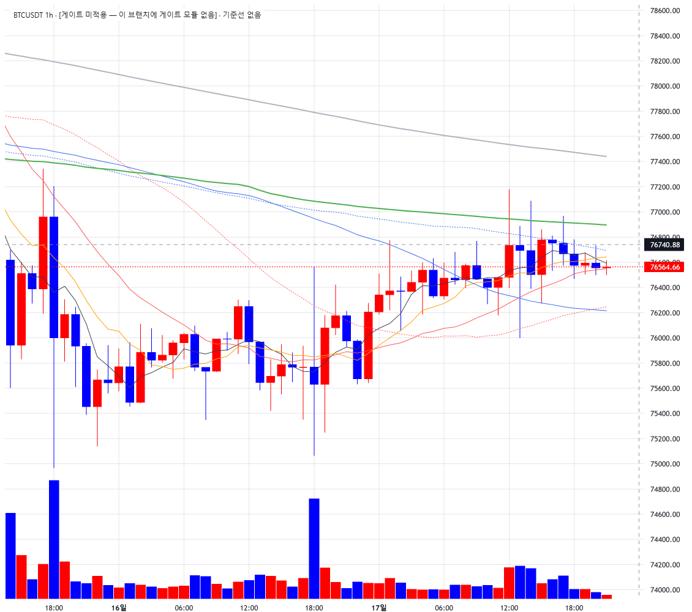

# signal-alarm 브랜치 — 차트 엔진 교체 1단계 보고: lightweight-charts (가격 패널만, Plotly 병존)

작성 2026-09-18. 렌더 계층 신설, 지표·알람 로직 무접촉, `charts/plotly_builder.py` 무수정.
**적용하려면 실행 중인 Streamlit 재시작 필요**(main 사이드바 위젯·import 추가, charts 모듈 신설).
8501 에서 돌고 있던 인스턴스는 이전 코드 상태이며 검증은 별도 포트 8502 인스턴스로 했다.

## 0. 먼저 — 판단 필요 사항 (승계 대상 부재)

위임장 §1 의 "구조 기준선(swing 저점·×0.995, 라벨 유지)" 과 "게이트 상태 라벨 병기 규칙·gate_context 필수
인자 원칙" 은 **main 브랜치(8cdd4e5, display/wave_gate_context.py)** 의 것이다. signal-alarm 은 main 과
2026-06-12(9436ed1)에 갈라졌고, 다음이 전부 없다:
`display/wave_gate_context.py`, `analysis/wave_align_gate_forward.py`, `analysis/wave_mm_struct_stop.py`,
`analysis/mm_shadow.py`, `analysis/wave_htf_gate_v2.py`, `validation/wave_align_gate_forward.csv`.

처리(중단 대신 — 나머지 범위는 이 결정과 무관해 완성했다):
- **렌더 계약은 그대로 승계·구현·테스트했다.** `gate_context` 는 위치 필수 인자(빈 문자열도 ValueError),
  `struct_reference` 는 `{"reference_low", "line_price"}` 로 가격선 2개(라벨 "직전 확정 패턴 저점" /
  "패턴 저점 기준선 (검증 중)" — main 문구 그대로), None 이면 선 없이 캡션에 "기준선 없음" 병기.
- **공급원은 지어내지 않았다.** main.py 의 `gate_context_for()` 는 고정 문구
  `[게이트 미적용 — 이 브랜치에 게이트 모듈 없음]` 을 넘기고, `struct_reference=None` 을 넘긴다.
  캡션에 그 상태가 그대로 보인다(스크린샷).
- **결정 요청**: (a) main 의 게이트·구조기준선 공급원을 이 브랜치로 이식할지(F2-b 연구 계층 + 사이드카
  CSV 의존이 슬림 앱에 들어온다), (b) 1단계는 고정 문구로 두고 2단계 때 함께 결정할지. 이식되면
  `gate_context_for` 한 곳과 `struct_reference=None` 한 곳만 바꾸면 된다.

## 1. 커밋

| 구분 | 해시 |
|---|---|
| 벤더링 charts/vendor/lightweight-charts.standalone.js | 2289e73 |
| 빌더 charts/lw_builder.py | a511ba5 |
| 배선 main.py + 테스트 tests/test_lw_builder.py | 7d3b4fb |
| 보고·스크린샷 | (이 문서 커밋) |

## 2. 구조 (위임장 §0 고정 사항 이행)

- 서드파티 래퍼 미사용. `st.components.v1.html` 에 standalone JS 를 **HTML 문자열에 인라인**해 임베드한다
  (iframe 은 저장소 파일을 못 읽는다). 설치돼 있는 `streamlit-lightweight-charts` 패키지는 쓰지 않는다.
- **벤더 버전: lightweight-charts 5.2.1** (npm `latest`, 2026-09-18 기준 v5 최신 안정판. 5.x 안정판 이력
  5.0.7 → 5.0.9 → 5.1.0 → 5.2.0 → 5.2.1). 원본 `dist/lightweight-charts.standalone.production.js`,
  sha256 `e21cc5caa0226ef30bd8549c50b9ef926615f2a4ee6b4e486353477a55f598cf`, Apache-2.0. 파일 상단에
  출처·버전·해시·갱신 절차 주석, 원본 라이선스 헤더 유지. 테스트가 헤더 해시와 본문 해시 일치를 확인한다.
- `charts/lw_builder.py`: 데이터프레임 → JSON(시간 오름차순·중복 시각 제거·NaN 제외·거래량 적/청) →
  HTML 문자열. 토큰은 `plotly_builder`(COLOR_BULL/BEAR·RECENT_WINDOW·배경/그리드/글자색)와
  `config.settings`(MA_COLORS·MA_LINE_WIDTHS)에서 import 만 한다. 시간은 naive 인덱스를 UTC 초로 보내
  LW(UTC 표시)가 Plotly 와 같은 벽시계를 보이게 했다.
- 사이드바 "차트 엔진" 라디오 (Plotly / LW), **기본 Plotly 유지**. LW 선택 시에만 `render_lw_chart`.

## 3. 1단계 범위 (LW 선택 시)

- 캔들(상승 적 `#ff0000` / 하락 청 `#0000ff`, 심지·테두리 동일) + 이평 8종 전부(색 승계, 굵기는 LW 정수
  제약으로 1.0/1.2/1.4 → 1, 1.6/1.8 → 2, 40·80 은 Plotly 와 같이 점선) + 거래량 히스토그램(하단 20%
  오버레이, 별도 price scale) + 구조 기준선 2개(`createPriceLine`, 축 라벨 표시) + 게이트 상태 라벨(차트
  좌상단 HTML 오버레이 캡션 `심볼 TF · gate_context [· 기준선 없음]`).
- 스토캐·MACD·RSI·알람 마커 없음 — 차트 아래 캡션 "LW 엔진 1단계: 가격 패널만. 스토캐·MACD·RSI·알람
  마커는 2단계 예정." 만 낸다. 사이드바의 하위 패널 토글·표시 모드는 LW 에서는 영향이 없다(2단계 대상).
- 초기 표시 창은 Plotly 와 같은 최근 150봉(RECENT_WINDOW).

## 4. 동작 요건 확인 (BTC 1h, 1000봉 적재, 높이 1000, 뷰포트 1600)

브라우저에서 `window.__lw`(검증용 핸들)로 실측했다. 마우스 이벤트는 Playwright 의 실제 휠·드래그.

| 단계 | 보이는 봉 | 보이는 시리즈 고·저 | 가격축 상·하단 | 축 폭 |
|---|---:|---|---|---:|
| 초기(150봉) | 150 | 79,600 / 74,968 | 80,130 / 73,312 | 6,818 |
| **휠 줌 후** (오른쪽 끝 근처, 10틱) | 57 | 77,343 / 74,968 | **78,644 / 73,789** | **4,855** |
| 드래그 팬 후 (과거로 300px) | 60 | 79,600 / 74,968 (고점 재진입) | 80,130 / 73,312 | 6,818 |

- **x 줌·팬 시 y 자동 밀착**: 줌으로 고점(79,600)이 창 밖으로 나가자 축 상단이 80,130 → 78,644 로 내려왔고,
  팬으로 고점이 다시 들어오자 되돌아왔다. Plotly 경로에서 못 하던 것(초기 렌더만 밀착)이 된다.
  축 상단이 캔들 고점(77,343)이 아니라 78,644 인 것은 autoScale 이 **보이는 모든 시리즈**(MA240 ≈ 78.2k
  포함)에 맞추기 때문이며, Plotly 의 `_fit_yaxes_to_window` 가 MA 열을 포함하던 것과 같은 규칙이다.
- **휠 줌·드래그 팬·크로스헤어**: 휠 10틱에 150 → 57봉, 드래그 300px 에 창 이동, 페이지 스크롤 없음
  (scrollY 0 유지 — LW 가 wheel 을 소비). 크로스헤어 Normal 모드(스크린샷의 점선 십자).
- **컨테이너 폭 추종**: iframe 폭 1130 = 부모 컬럼 폭 1130, `autoSize: true`(ResizeObserver). 높이는
  사이드바 셀렉트 값이 iframe 높이(1000)로 그대로 들어간다.
- **색 토큰**: 캔들·거래량 상승 적/하락 청, 이평 색 `MA_COLORS` 그대로(테스트로 고정).

### 스크린샷

| 줌 전 (최근 150봉) | 휠 줌 후 (57봉, y 밀착) |
|---|---|
|  |  |

팬 후: `img/lw_stage1_after_pan.png`. 캡션 `BTCUSDT 1h · [게이트 미적용 — 이 브랜치에 게이트 모듈 없음] ·
기준선 없음` 이 좌상단에 보인다(§0).

## 5. 테스트

| 묶음 | 결과 |
|---|---|
| tests/test_lw_builder.py (신규 15건) | 15 passed |
| 기존 차트 경로: test_slim_app_smoke · test_alarm_signals · test_code_version · test_panel_smoke | 45 passed, 1 skipped (변경 전과 동일 → Plotly 경로 무영향) |
| 전체 tests/ | 628 passed, 2 failed, 1 skipped — 실패 2건은 test_wave_ruleset_robustness (numpy2/pandas3 기존 회귀, 이번 변경과 무관) |

신규 테스트 내용: JSON 직렬화(정렬·중복·NaN·UTC 초·거래량 색) / gate_context 필수(TypeError·ValueError) /
기준선 없음 폴백·기준선 2개 라벨·금지 표현 부재 / 벤더 파일 존재·버전 헤더·sha256 일치 / 동작 요건 옵션
(autoScale·mouseWheel·pressedMouseMove·crosshair·autoSize) / 이평 토큰 승계·굵기 매핑 / HTML 임베드
(벤더 인라인·WINDOW·높이·시리즈 종류) / components.html 스모크(높이 전달·2단계 캡션·빈 프레임 스킵) /
main 엔진 라디오 기본 Plotly / plotly_builder 가 lw 계층을 모름.

## 6. 남은 것 · 한계

- §0 결정(게이트·구조기준선 공급원 이식 여부).
- 가격축 눈금이 거래량 띠 뒤(하단 22%)까지 이어진다 — LW 오버레이 방식의 특성. 2단계에서 거래량을
  별도 패널(pane)로 옮길지 함께 본다.
- 범례 없음(1단계 미포함). 이평 식별은 색 토큰으로만.
- Streamlit 재실행 때마다 벤더 JS(≈199KB)를 HTML 에 다시 인라인한다. 체감 지연은 없었으나 2단계에서
  `components.declare_component`/정적 서빙으로 옮길지 검토 대상.
- 검증에 쓴 `window.__lw` 핸들은 남겨 두었다(측정·2단계 디버깅용, 사용자 노출 없음).
