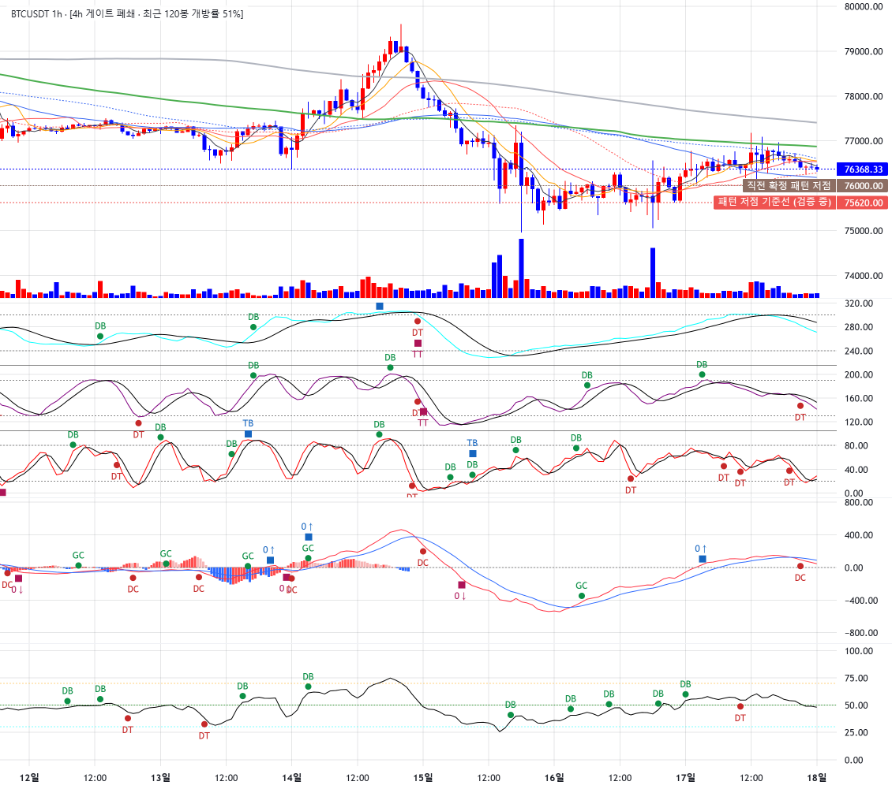
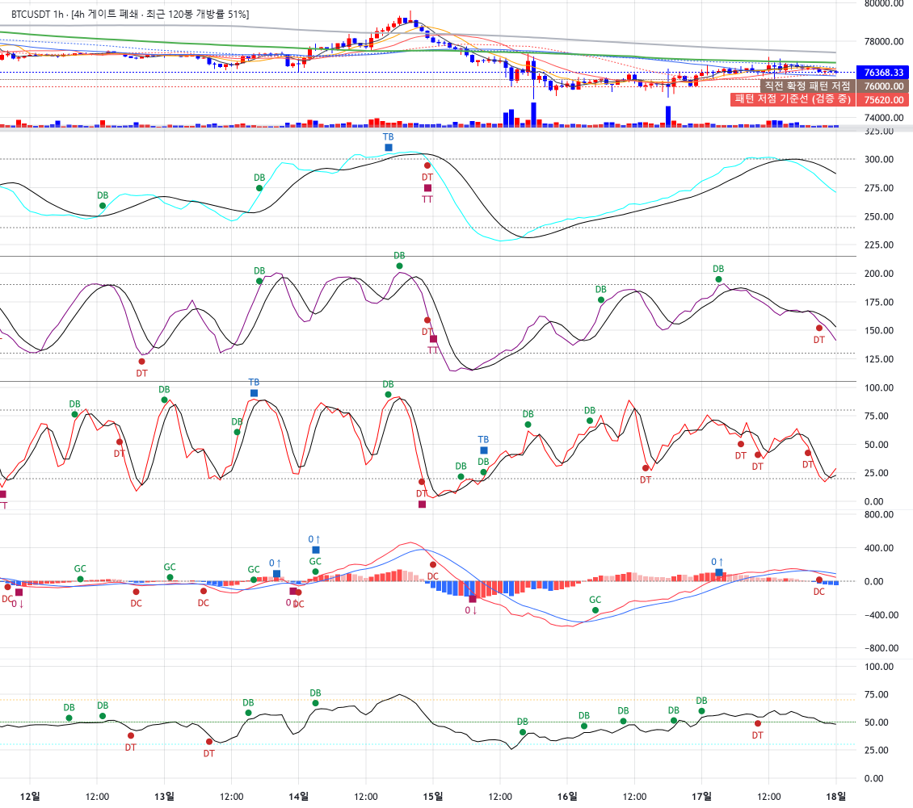
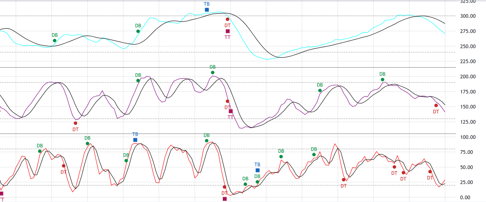
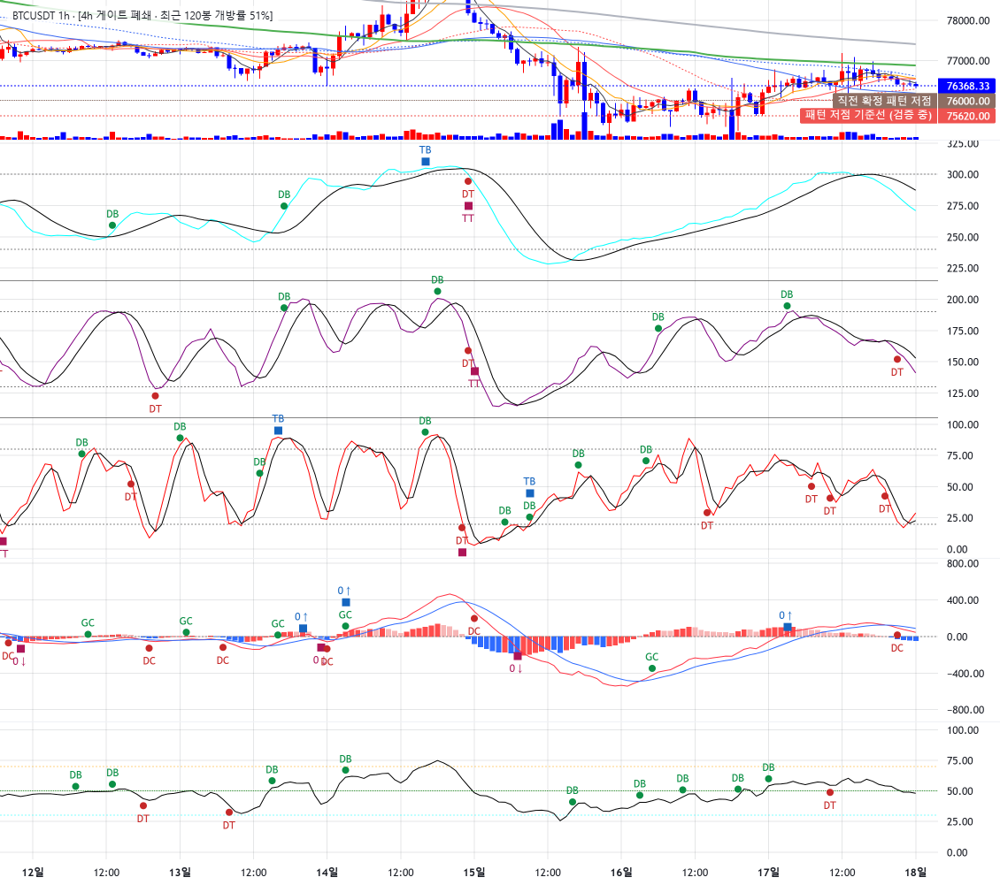

# signal-alarm 브랜치 — 차트 엔진 교체 2단계 보고: 하위 pane · 마커 · 게이트 이식 · 세로 줌 · 기본 엔진 전환

작성 2026-09-18. 렌더 이식이며 지표·알람 계산 로직 무접촉, `charts/plotly_builder.py` 무수정(병존 유지).
**적용하려면 실행 중인 Streamlit 재시작 필요**(main import·사이드바 기본값, charts/display 모듈, analysis 파일 5개 추가).
8501 인스턴스는 이전 코드 상태이며 검증은 별도 포트 8502 로 했다.

## 0. 요약

- LW 엔진이 Plotly 5패널과 동등한 정보를 **단일 차트의 pane 4개**(가격+거래량 / 스토캐 3중 / MACD / RSI)로
  그리고, 알람 마커 전량, 게이트 라벨·구조 기준선 **실공급**, 패널 경계 드래그, 세로 줌까지 갖췄다.
- **기본 엔진을 LW 로 전환**했다(위임 §6). Plotly 는 라디오에 남아 회귀 확인 경로로 쓴다.
- **휠 세로 줌: 채택.** 간섭 검사(본체 휠 x줌·팬·크로스헤어·축 더블클릭 복귀) 전 항목 통과(§5).
- 게이트 라벨·구조 기준선 공급은 위임 §4 회신대로 **정의 파일만 체리픽**(main 74fa4ad, diff 없음을 테스트가
  단언). 라이브 결과 예: `[4h 게이트 폐쇄 · 최근 120봉 개방률 51%]`, 기준선 76,000 / 75,620(×0.995).

## 1. 커밋 (분리)

| 구분 | 해시 |
|---|---|
| 하위 패널 (panes, 경계 리사이즈 활성) | feaedf3 |
| 알람 마커 (createSeriesMarkers) | e5179e8 |
| 게이트 라벨·구조 기준선 공급 (체리픽 5파일 + 글루 + main 배선) | b882da5 |
| 세로 줌 (가격축 휠 + 더블클릭 복귀) | a613077 |
| 고정 스케일 pane·iframe 마진 수정 (실측 후 교정) | 30bd7dc |
| 기본 엔진 LW 전환 | c1701e6 |
| 보고·스크린샷 | (이 문서 커밋) |

## 2. 하위 패널 이식 (§1)

- LW v5 panes: `chart.addSeries(Series, opts, paneIndex)`. 스택 차트 아님. pane 0 가격(캔들·이평·거래량 하단
  20% 오버레이·구조 기준선·게이트 캡션) / 스토캐 3중 / MACD / RSI. 토글 꺼짐·컬럼 없음이면 pane 미생성.
- 스토캐 3중: 현행 방식 승계 — 한 pane 에 `stoch_*_shifted_*` 오프셋(0/110/220) 배치, 층당 20/80 참조선
  (가격선), 층 분리선 2, 색·굵기 토큰 승계. 스케일 0~320 **고정**(autoScale off + `setVisibleRange`, 마진 2%).
- MACD: hist(plotly 4색 규칙 그대로) + macd/signal 라인 + 0선. autoscale, 마진 10%/10%.
- RSI: 라인 + 30/50/70 참조선(현행 색·스타일). 0~100 고정(마진 5%).
- 초기 비중 `PANE_STRETCH` 39/26/19/16 = Plotly 지표 중심(0.34+0.05 / 0.26 / 0.19 / 0.16) 근사.
  실측 1000px: 378 / 252 / 184 / 155px(+ 분리선 3 + 시간축 28).
- 교정 1건(30bd7dc): 처음엔 autoscale 로 스토캐 범위가 −186~419 로 벌어졌다(마커 여백을 autoscale 이 더함).
  `priceScale.setVisibleRange` 로 못 박아 −8~327(0~320 + 2%) 로 고정. iframe 문서의 기본 body 마진 8px 도 제거
  (차트가 8px 밀려 시간축이 잘리고 pane 경계 좌표가 어긋나던 원인).

## 3. 패널 드래그 리사이즈 (§2 — 핵심 수확)

`layout.panes.enableResize = true`. 경계 위 커서 `row-resize` 확인. 가격/스토캐 경계를 위로 220px 끌어올린 결과:

| | 가격 | 스토캐 | MACD | RSI |
|---|---:|---:|---:|---:|
| 기본 | 378 | 252 | 184 | 155 |
| 드래그 후 | 158 | **472** | 184 | 155 |

| 기본 | 스토캐 확대 후 |
|---|---|
|  |  |

스토캐 pane 을 끌어올려 크게 볼 수 있다. 확대 상태는 세션 중 유지되며(리렌더 시 초기 비중으로 돌아감 — 다음 한계 참조).

## 4. 알람 마커 (§3)

- 스토캐 DB/DT/TB/TT → 층별 K 시리즈, RSI DB/DT → RSI 라인, MACD GC/DC/0↑/0↓ → MACD 라인에
  `createSeriesMarkers`. 텍스트 라벨 유지, 방향 색 승계(DB `#0B8F45`·DT `#C62828`·TB `#1565C0`·TT `#AD1457`,
  MACD 는 `_MACD_EVENT_STYLE` 그대로), circle→circle, diamond→square, top/bottom center → aboveBar/belowBar.
- 확정 봉 위치 원칙 그대로: 지표 컬럼 non-null 봉, MACD 는 `analysis.alarm_signals.macd_event_positions`
  (알람 목록과 동일). 억제 로직 없음 — BTC 1h 1000봉 기준 스토캐 44/72/118, RSI 73, MACD 112 개 전량.
- 근접 스크린샷(스토캐 pane 확대 상태): 라벨 판독 가능. 겹침은 같은 봉에 DT 와 TT 가 동시에 뜬 지점뿐.

## 5. 게이트 라벨·구조 기준선 공급 (§4 — 체리픽)

- **체리픽(verbatim, 원본 origin/main `74fa4ad`, 8cdd4e5 계열, 그 뒤 변경 없음):**
  `analysis/wave_htf_gate.py`(interval_delta·close_time_of) · `analysis/wave_htf_gate_v2.py`(f2b_rising_flags,
  PAIRS_V2) · `analysis/wave_align_gate_forward.py`(gate_states·current_gate_status — **마지막 닫힌 봉 asof**,
  trailing_run, PROMOTED_LTF_TO_HTF) · `analysis/wave_mm_struct_stop.py`(struct_stops — swing 저점·×(1−BUFFER=0.995))
  · `analysis/wave_mm_simulator.py`(struct_stop 이 STOP_PCT 를 import 하므로 함께). 이 파일들이 import 하는
  하위 모듈(engine·wave_tracker·wave_energy·wave_structure_confirmation 등)은 이 브랜치에 이미 main 과 동일하게 있다.
  `tests/test_lw_gate_context.py` 가 매니페스트 sha256 과 `git show 74fa4ad:<path>` 로 diff 없음을 단언한다.
- **가져오지 않은 것:** 사이드카 CSV·`_htf_gate_v2_cache`·validation 데이터·`mm_shadow`·`display/wave_gate_context`
  (mm_shadow 를 import 하므로 제외). HTF 데이터는 체리픽한 `load_htf_pipe` 가 슬림 앱의 `display.asof` 로
  라이브 취득한다(심볼×HTF 한 셀, 15분 캐시).
- **글루 `display/lw_gate_context.py`:** import 만 한다. `gate_label` 문구는 main 과 동일
  (`[4h 게이트 개방 N봉]` / `[4h 게이트 폐쇄 · 최근 120봉 개방률 N%]` / `[4h 게이트 상태 불명]` /
  `[게이트 미적용 TF]`). `struct_reference` 는 적재된 LTF 프레임을 `struct_stops` 에 넣는다 — 앵커는 마지막
  **닫힌** 봉(struct_stops 의 진입가 = 다음 봉 시가 정의상 진행 중 봉이 그 다음 봉). 미검출·퇴화·예외 → None
  → "기준선 없음" 폴백 유지.
- main: `gate_context_for` 고정 문구 → `gate_label` 실공급, `struct_reference` 실공급.
- 라이브 결과(BTC 1h, 2026-09-18): 캡션 `[4h 게이트 폐쇄 · 최근 120봉 개방률 51%]`, 기준선 76,000.00 /
  75,620.00 (스크린샷 우측 축 라벨).

## 6. 세로 줌 (§5) — 채택

- 기본 제공 확인·명시: `handleScale.axisPressedMouseMove`(가격축 누른-드래그 스케일), `axisDoubleClickReset`
  {time, price}. 조작법 캡션에 "가격축 위 휠 = 세로 확대·축소 · 가격축 드래그 = 세로 스케일 · 가격축 더블클릭 =
  자동 맞춤 복귀 · 패널 경계 드래그" 추가.
- 커스텀: `#lw-wrap` 캡처 단계 wheel 리스너. 가격 pane 의 가격축 영역(축 폭·pane 높이는 API 로 계산, DOM 내부 구조
  미의존) 위에서만 동작하고 그 외는 통과. 커서 가격 기준 0.8×/1.25×. 구현은 **공개 API** 인
  `autoscaleInfoProvider`(캔들·이평 시리즈에 고정 범위) + `scaleMargins` 0 으로 정확 매핑. 더블클릭 → provider 해제·
  마진 복원(autoScale 복귀).
- **간섭 검사 실측** (BTC 1h, 실제 마우스 이벤트):

| 단계 | 시간축 논리 범위 | 가격축 범위 | 세로 줌 상태 |
|---|---|---|---|
| 초기 | 850 ~ 1002 | 73,457 ~ 80,134 | 꺼짐 |
| 가격축 위 휠 3틱(위) | 850 ~ 1002 (불변) | **75,011 ~ 78,496** | 켜짐 |
| 본체 휠 3틱 | **870 ~ 984 (x 줌 동작)** | 75,011 ~ 78,496 (유지) | 켜짐 |
| 드래그 팬 | 857 ~ 971 (이동) | 75,011 ~ 78,496 (유지) | 켜짐 |
| 가격축 더블클릭 | 857 ~ 971 | **73,457 ~ 80,134 (복귀)** | 꺼짐 |
| 스토캐 축 더블클릭 | — | 스토캐 −7~327 유지 | — |

  페이지 스크롤 0 유지(휠이 페이지로 새지 않음), 크로스헤어 이동 정상, 콘솔 에러 0. 축 위 휠은 x줌과 **충돌하지 않는다**
  (축 위에서는 x줌이 일어나지 않고, 본체에서는 세로 줌이 일어나지 않는다). 채택.

## 7. 기본 엔진 전환 (§6)

`CHART_ENGINES = ("LW", "Plotly")`, `DEFAULT_CHART_ENGINE = "LW"`. Plotly 라디오 유지. "표시 모드" 라디오는 Plotly 에만
적용된다(LW 는 경계 드래그로 대체) — help 문구에 명시.

## 8. 테스트

| 묶음 | 결과 |
|---|---|
| tests/test_lw_builder.py (23건: pane 직렬화·마커·세로 줌·배선) + tests/test_lw_gate_context.py (9건: 체리픽 동일성·gate_label·닫힌 봉 asof·struct_reference·폴백) + tests/test_slim_app_smoke.py (Plotly 경로) | 49 passed |
| 전체 tests/ | 645 passed, 2 failed, 1 skipped — 실패 2건은 test_wave_ruleset_robustness (numpy2/pandas3 기존 회귀, 이번 변경과 무관). 1단계 628 → 645 (신규 17건) |

## 9. 한계 · 남은 것

- 패널 드래그 결과는 Streamlit 리렌더(심볼·TF 변경, 위젯 조작) 때 초기 비중으로 돌아간다. 유지하려면 iframe →
  Streamlit 상태 전달(components 양방향)이 필요 — 이번 범위 밖.
- 마커 동시 발생(같은 봉 DT+TT, GC+0↑) 겹침은 남는다(억제 로직 신설 금지).
- MACD pane 은 autoscale 이라 마커 여백만큼 위아래가 넓다(−933~845, 데이터 약 −600~500).
- 세로 줌은 가격 pane 전용. 고정 스케일 pane(스토캐·RSI)에는 의미가 없고 MACD 는 미적용.
- 게이트 라벨은 승격 쌍의 LTF(1h→4h, 6h→1d)에서만 정의된다(그 외 `[게이트 미적용 TF]`) — main 규칙 그대로.
- 매 렌더마다 벤더 JS(≈199KB) 인라인(1단계와 동일).
