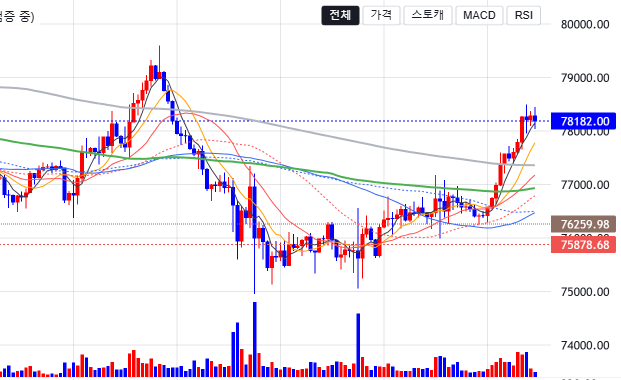
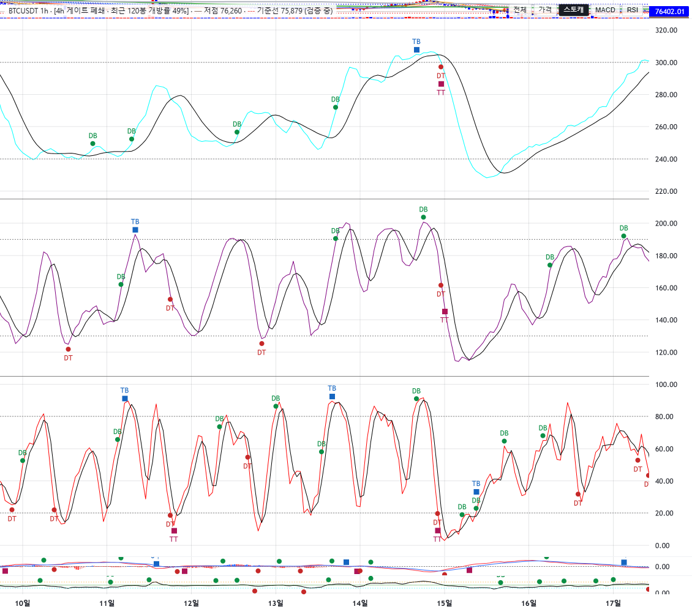
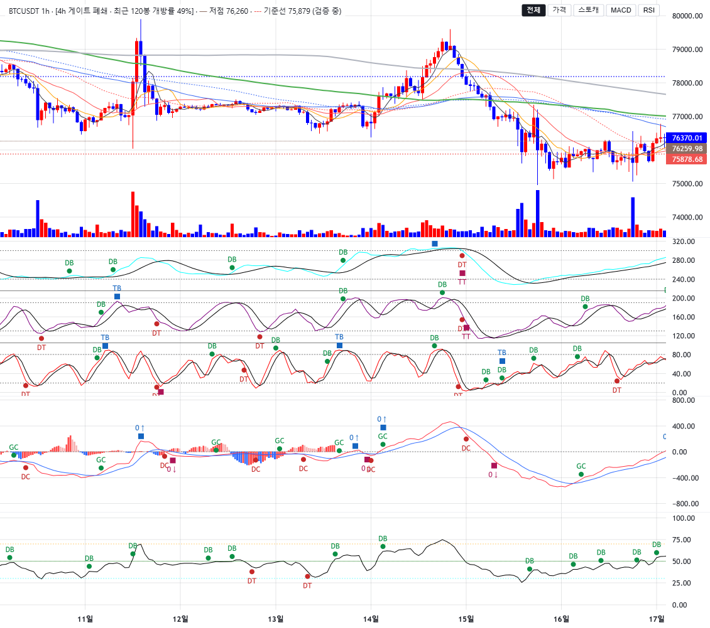

# signal-alarm 브랜치 — LW 차트: 기준선 라벨 정리 + pane 단독 확대 모드 보고

작성 2026-09-18. `charts/lw_builder.py` 만 수정(display 글루·main 무변경). 지표·알람·게이트 정의 무접촉,
Plotly 경로 무수정. **적용하려면 실행 중인 Streamlit 재시작 필요**(Streamlit 이 charts 모듈 변경을 재import 하지
않는 것을 2단계에서 확인함). 8501 인스턴스는 이전 코드 상태이며 검증은 별도 포트 8502 로 했다.

## 1. 커밋 (분리)

| 구분 | 해시 |
|---|---|
| 기준선 라벨 정리 | 113b4bc |
| pane 단독 확대 모드 | 601f7ca |
| 보고·스크린샷 | (이 문서 커밋) |

## 2. 기준선 라벨 정리 (§1)

- 가격선 2개(직전 확정 패턴 저점 / 패턴 저점 기준선)의 **차트 내 title 을 비웠다**(`title: ""`). 캔들을 가리던
  라벨 상자가 사라진다. 축 가격 뱃지는 유지하며 색으로 구분 — 저점 `#8D6E63` 점선, 기준선 `#EF5350` 파선(현행 색 승계).
- 의미는 게이트 캡션 줄로 이동, 색 견본(선 스타일 문자)을 각 선 색으로 칠해 1줄 병기:
  `BTCUSDT 1h · [4h 게이트 폐쇄 · 최근 120봉 개방률 49%] · ─ 저점 76,260 · ┄ 기준선 75,879 (검증 중)`.
  **"(검증 중)" 유지.** 기준선이 없으면 ` · 기준선 없음` 그대로. 가격은 1,000 이상 정수 천 단위, 미만 소수 2자리.
- 알람 마커 텍스트는 건드리지 않았다(createSeriesMarkers 경로 그대로).
- 스크린샷(라벨 정리 후 기준선 부근): 축 뱃지 76,259.98(갈색) / 75,878.68(적색)만 남고 차트 안 라벨 없음.

## 3. pane 단독 확대 모드 (§2)

- iframe 내부 우상단 반투명 버튼 **[전체 | 가격 | 스토캐 | MACD | RSI]** — 현재 있는 pane 만 생성(꺼진 패널·컬럼
  없음이면 버튼도 없음). 가격축(≈70px)을 피해 `right: 80px`.
- 구현: **JS 만으로 v5 `pane.setStretchFactor` 재배분**, Streamlit rerun 없음. 목표 px 를 그대로 factor 로 주면
  비례 배분이 정확한 px 가 된다(총 가용 높이 = `getHeight` 합). '전체' 는 초기 비중 `PANES[i].stretch` 복원.
- **접는 방식 선택:** 나머지 pane 은 0 으로 숨기지 않고 **30px 띠(`SOLO_COLLAPSED_PX`)로 접는다.** 근거: v5 에
  pane 을 0 높이로 두는 공식 경로가 없고(`removePane` 은 시리즈까지 제거해 복원 시 재생성이 필요), 30px 띠는
  시리즈·마커·고정 스케일·가격선을 전부 유지한 채 stretch 만 바꾸므로 복원이 무손실이다. 실측에서도 30px 로
  정확히 접혔다.
- **실측(BTC 1h, 1000px, 실제 마우스 이벤트):** 먼저 본체 휠로 시간축 줌, 가격축 휠로 세로 줌을 걸어 둔 뒤 버튼 조작.

| 단계 | pane 높이 (가격/스토캐/MACD/RSI) | 시간축 논리 범위 | 세로 줌 |
|---|---|---|---|
| 줌 걸어둔 상태 | 378 / 252 / 184 / 155 | 789.9 ~ 973.5 | 켜짐 74,653~79,183 |
| **스토캐 단독** | 30 / **879** / 30 / 30 | 789.9 ~ 973.5 (유지) | 유지 |
| 스토캐 단독에서 본체 휠 | 30 / 879 / 30 / 30 | 798.9 ~ 965.7 (시간축 줌 동작) | 유지 |
| 가격 단독 | **879** / 30 / 30 / 30 | 798.9 ~ 965.7 (유지) | 유지 |
| 가격 단독에서 가격축 휠 | 879 / 30 / 30 / 30 | 유지 | **75,098~78,730 (세로 줌 동작)** |
| 가격 단독에서 가격축 더블클릭 | 879 / 30 / 30 / 30 | 유지 | 꺼짐(복귀) |
| **전체 복귀** | 378 / 252 / 184 / 155 | 798.9 ~ 965.7 (유지) | 꺼짐 |

  단독 모드에서 시간축·크로스헤어·세로 줌(가격 pane) 정상, 스토캐 고정 스케일(0~320) 유지, 시간축 행 표시 유지
  (table 하단 1000px), 콘솔 에러 0. **줌·팬 상태는 어느 전환에서도 잃지 않는다** — 요건 충족. 중단 사유 없음.

| 스토캐 단독 | 전체 복귀 |
|---|---|
|  |  |

## 4. 테스트

| 묶음 | 결과 |
|---|---|
| tests/test_lw_builder.py (신규 3건: title 부재·label 보존·색 구분 / 캡션 줄 형식·색 견본·(검증 중) / 버튼이 pane 구성을 따름·JS 전용) + tests/test_lw_gate_context.py + tests/test_slim_app_smoke.py (Plotly 스모크) | 50 passed (라벨 커밋 시점) → 단독 모드 포함 LW 모듈 26 passed |
| 전체 tests/ | 648 passed, 2 failed, 1 skipped — 실패 2건은 test_wave_ruleset_robustness (numpy2/pandas3 기존 회귀, 이번 변경과 무관). 2단계 645 → 648 (신규 3건) |

## 5. 한계 · 남은 것

- 단독 모드·경계 드래그 결과는 Streamlit 리렌더(심볼·TF·위젯 변경) 때 초기 비중으로 돌아간다(2단계와 동일 — 양방향
  컴포넌트 필요).
- 접힌 30px 띠에서는 시리즈가 압축돼 보인다(정보 없음). 띠를 더 얇게(예 16px) 할 수 있으나 분리선 드래그 손잡이(9px
  히트 영역)와 겹치므로 30px 로 두었다.
- 캡션이 길어지면(긴 게이트 라벨 + 기준선) 좁은 화면에서 버튼과 가까워진다. 1130px 폭에서는 여유 있음.
