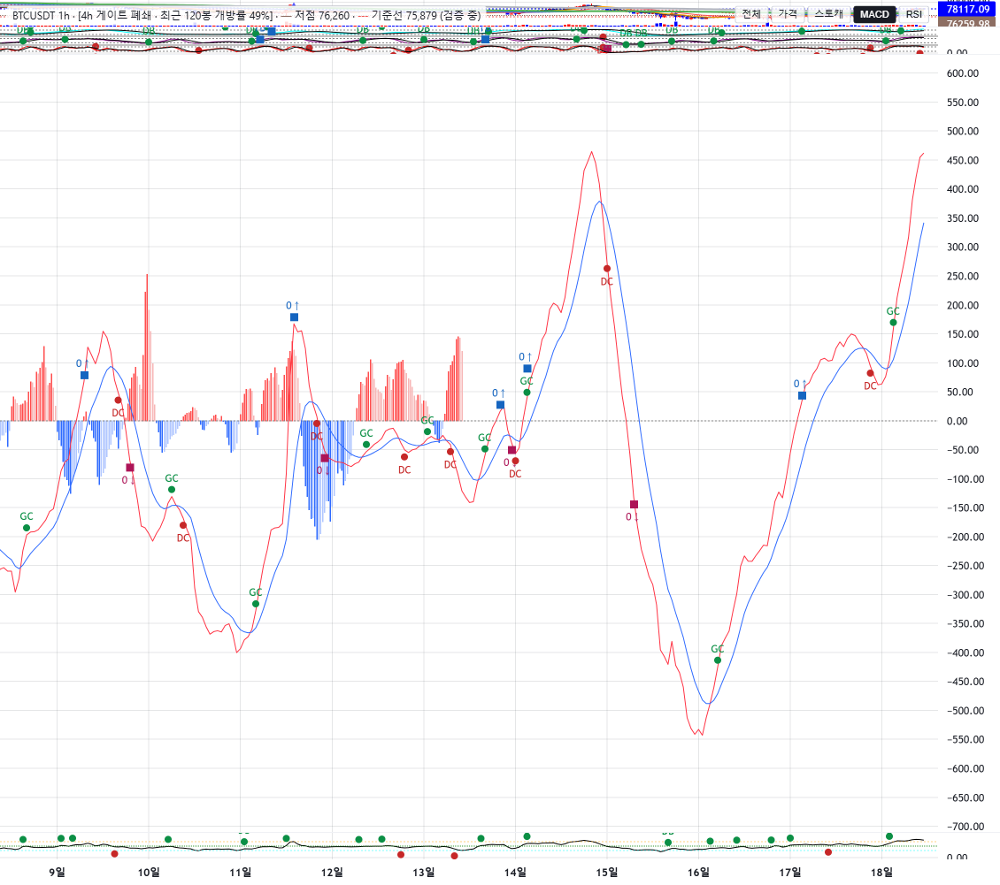
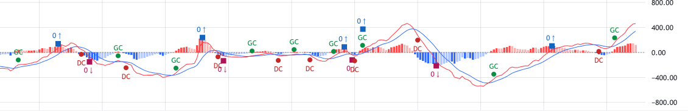

# signal-alarm 브랜치 — LW MACD 히스토그램 4색 규칙 보고 (표시 계층만)

작성 2026-09-18. `charts/lw_builder.py` + 신설 `charts/theme.py` + 테스트만. MACD 계산·알람 정의 무접촉
(`macd_hist` 값 불변, df 에 컬럼을 쓰지 않음). Plotly 경로는 이번 범위 밖(기존 규칙 그대로).
**적용하려면 실행 중인 Streamlit 재시작 필요.** 8501 인스턴스는 이전 코드 상태이며 검증은 별도 포트 8502 로 했다.

## 0. 진단 (변경 전)

- 색은 `macd_hist`(cur)와 `macd_hist_prev`(prev)만으로 결정됐다. 규칙은 plotly 것을 그대로 옮긴 것으로,
  **1차 기준이 "직전 봉 대비 증가"** 였다: `cur ≥ prev → 진한 적(부호 무관)`, `cur ≥ 0 & 감소 → 옅은 적`,
  `cur < 0 & 감소 → 진한 청`, 나머지 → 옅은 청. 따라서 **음수 구간에서 증가하면 진한 적**이 됐고, 옅은 청
  분기는 논리상 도달 불가(음수·감소가 아니면서 증가도 아닌 경우가 없음)라 실제로는 3색만 보였다.
- 명암이 다른 의미(미확정 봉·후보 등)를 갖는 곳은 LW 경로에 없다(투명도·candidate 처리 없음). 따라서 의미 손실
  없이 교체 가능 → 중단 사유 없음.
- `macd_hist_prev` 는 `indicators/oscillators.py` 가 `macd_hist.shift(1)` 로 기록한다. 알람(GC/DC)도 이 컬럼을
  쓰므로 비교 기준을 그대로 승계했고, 없으면 표시 계층에서 `shift(1)` 로 대체한다.

## 1. 커밋

| 구분 | 해시 |
|---|---|
| 4색 규칙 + theme 토큰 + 테스트 | 6522040 |
| 보고·스크린샷 | (이 문서 커밋) |

## 2. 규칙 (부호 1차 · 직전 봉 대비 증감 2차)

| 조건 | 색 | 토큰 |
|---|---|---|
| hist ≥ 0 & hist > prev | 진한 적색 `#FF4D4D` (기존 상승색 토큰) | `pos_rising` |
| hist ≥ 0 & hist ≤ prev | 옅은 적색 `#F7B6B6` | `pos_falling` |
| hist < 0 & hist < prev | 진한 청색 `#2F6BFF` (기존 하락색 토큰) | `neg_falling` |
| hist < 0 & hist ≥ prev | 옅은 청색 `#AFC6FF` (하늘색) | `neg_rising` |
| 첫 봉 (prev 결측) | 부호의 진한 색 | — |

경계: `hist == prev` 는 증가가 아니므로 옅은 색, `hist == 0` 은 ≥0 쪽. 진한 색 hex 는 기존 MACD 히스토그램
토큰 그대로이며 MACD 선 색(`#FF3344`)·signal 선 색(`#2F6BFF`)은 건드리지 않았다.

## 3. 토큰 위치

`charts/theme.py` 신설 — `MACD_HIST_COLORS` 4키. `lw_builder` 는 import 만 하고 히스토그램 색 dict 를 정의하지
않는다(테스트가 정의 부재·옅은 2색 리터럴 부재를 단언). 명도 조정은 theme 한 줄.

## 4. 검수

BTC 1h, 최근 150봉 창(양수 증가→감소 전환과 음수 구간 포함) 실측: 보이는 봉의 색 분포 진한 적 76 · 옅은 적 62 ·
진한 청 48 · 옅은 청 57, 양수 증가→감소 전환·음수 감소→증가 전환 모두 창 안에 존재. 1000봉 전체 295/245/225/235.

| MACD 단독 확대 | 전체 뷰 MACD pane |
|---|---|
|  |  |

## 5. 테스트

| 묶음 | 결과 |
|---|---|
| tests/test_lw_builder.py (신규 2건: 네 조합·경계 hist==prev·hist==0·첫 봉·부호 교차 / prev 컬럼 사용·df 무변경·하드코딩 부재; 기존 payload 테스트는 4색 등장으로 갱신) + tests/test_lw_gate_context.py + tests/test_slim_app_smoke.py (Plotly 스모크) | 54 passed |
| 전체 tests/ | 650 passed, 2 failed, 1 skipped — 실패 2건은 test_wave_ruleset_robustness (numpy2/pandas3 기존 회귀, 이번 변경과 무관). 직전 648 → 650 (신규 2건) |

## 6. 비고

- Plotly 경로(`plotly_builder.add_macd_panel`)는 예전 규칙(증감 1차)이 그대로다. 두 엔진의 MACD 색 의미가 이제
  다르다 — Plotly 도 맞출지는 별도 결정.
- 히스토그램이 MACD 선의 autoscale(±500) 안에서 작게 보이는 것은 이번 범위 밖(2단계 한계 그대로).
