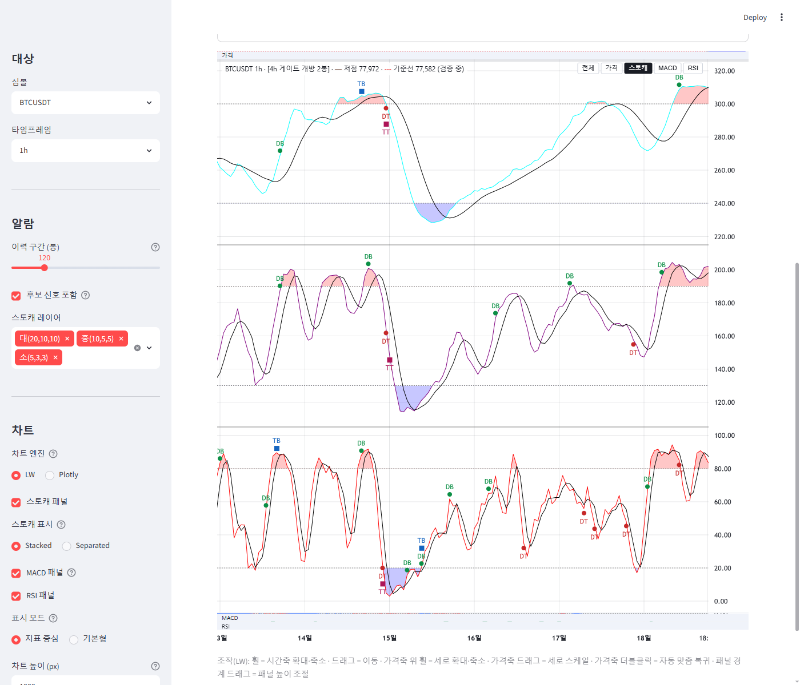
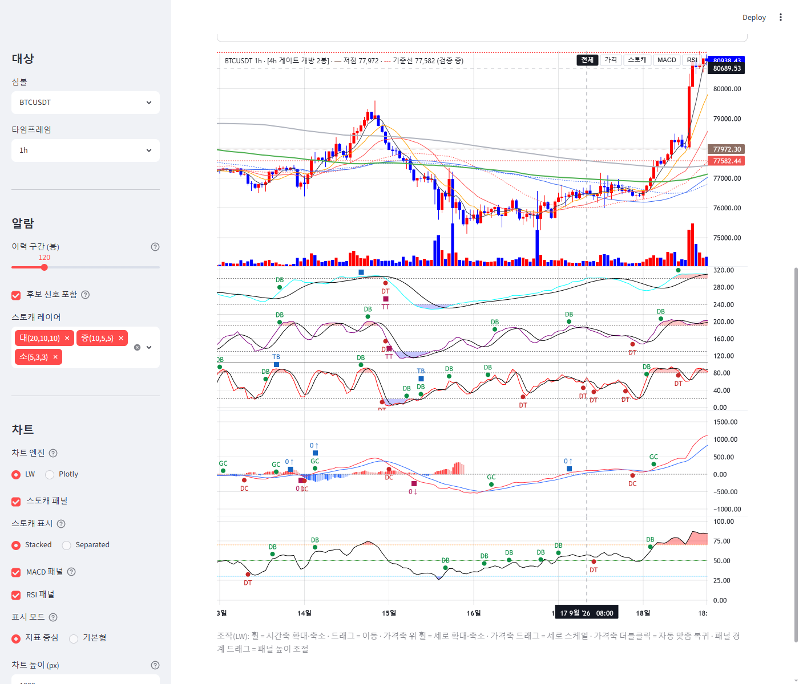

# signal-alarm 브랜치 — LW pane 단독 확대 모드 개선 보고 (접힌 띠 축소 + 컨테이너 확장)

작성 2026-09-19. `charts/lw_builder.py` + `tests/test_lw_builder.py` 만 수정(theme 토큰 추가 없음 — 띠 색·글자 크기는
lw_builder 상수). 지표·알람·게이트 정의 무접촉, Plotly 경로 무수정, display 글루·main 무변경.
**적용하려면 실행 중인 Streamlit 재시작 필요**(charts 모듈 변경은 재import 되지 않음). 검증은 별도 포트 8502 재시작으로 했다.

## 1. 커밋 (분리)

| 구분 | 해시 |
|---|---|
| 접힌 띠 14px + 이름 오버레이 + 컨테이너 확장 (+테스트 1건 신규·1건 갱신) | 9a11cce |
| 보고·스크린샷 | (이 문서 커밋) |

## 2. 접힌 pane 띠 높이 — 실측과 채택값 (§1)

**채택: `SOLO_COLLAPSED_PX = 14`** (30 → 14).

하한 실측(BTC 1h, 1000px, 벤더 v5.2.1, `setStretchFactor` 로 목표 px 배분):

| 목표 px | 실측 pane 높이 (가격/스토캐/MACD/RSI) | RSI 고정 스케일 | 가격 좌표 계산 | 콘솔 에러 |
|---|---|---|---|---|
| 30 | 30 / 879 / 30 / 30 | 0~100 유지 | 정상 | 0 |
| 20 | 20 / 909 / 20 / 20 | 유지 | 정상 | 0 |
| **14** | **14 / 927 / 14 / 14** | 유지 | 정상 | 0 |
| 10 | 10 / 939 / 10 / 10 | 유지 | 정상 | 0 |
| 6 | 6 / 951 / 6 / 6 | 유지 | 정상 | 0 |
| 2 | 2 / 963 / 2 / 2 | 유지 | 정상 | 0 |
| 1 | **2** / 966 / 2 / 2 | 유지 | 정상 | 0 |
| 0 | **2** / 969 / 2 / 2 | 유지 | 정상 | 0 |

전체 복귀 후 378/252/184/155, 스토캐 0~320·RSI 0~100 고정 스케일, 캔들 1000·MACD 1000 점 그대로 — 모든 높이에서 무손실.

근거:
- **LW 바닥은 2px.** 벤더 레이아웃 코드가 pane 높이를 `Math.max(round(stretch × 비율), 2)` 로 계산한다(마지막 pane 은 나머지).
  stretch 0·1 을 줘도 2px 이 된다. `pane.setHeight()` API 는 `Math.max(30, …)` 클램프, 분리선 드래그도 30 클램프
  (인접 두 pane 합이 60px 이하면 드래그 자체를 시작하지 않음).
- 시리즈·마커·고정 스케일·가격선은 모델 객체라 pane 높이와 무관하게 유지된다 — 2px 까지 확인(표).
- **14 를 고른 이유:** 위임장 §1 "띠에 pane 이름 표시". 10px 글자를 얹을 수 있는 최소 높이가 14px(line-height=띠 높이).
  그 아래(10·6·2)는 기능적으로는 되지만 이름을 못 얹는다.
- 띠에는 **불투명 이름 오버레이**(`#lw-strips`, `.lw-strip`)를 얹어 압축된 시리즈 대신 pane 이름만 보인다. 위치는
  `pane.getHTMLElement().getBoundingClientRect()` 를 따르며(autoSize 반영 뒤 rAF·ResizeObserver·경계 드래그 mouseup 에 재배치),
  **클릭 → 그 pane 단독** 으로 전환(버튼과 동일 `applySolo`). 실측: MACD 띠 클릭 → 14/14/969/14, 가격 띠 클릭 → 969/14/14/14,
  RSI 띠 클릭 → 14/14/14/969.
- 부수 수정: LW 분리선의 드래그 히트 영역(9px, z-index 50)이 14px 띠에서는 버튼 줄(top 6px)과 겹쳐 **클릭을 가로챘다**
  (실측: 버튼 좌표의 elementFromPoint 가 히트 영역 div). 캡션·버튼·띠 z-index 를 60/61 로 올려 해결(`LW_OVERLAY_Z`).
  가격 pane 이 접히면 캡션·버튼 줄을 띠 아래(top 20px)로 내려 '가격' 이름과 겹치지 않게 했다.

## 3. 컨테이너 확장 (§2)

단독 진입 시 `#lw-wrap` 높이 = 선택 높이(1000) + 접힌 띠 합계(14×3 = 42) = **1042**. iframe 은 `window.frameElement`
(Streamlit 의 srcdoc iframe 은 `allow-same-origin` 이라 접근 가능)의 style/height 를, Streamlit 요소 컨테이너
(`stElementContainer`, `flex: 0 0 1000px` 로 고정돼 있음)는 inline `height`·`flex-basis` 를 같은 값으로 준다.
전체 복귀 시 셋 다 base(1000)로. **Streamlit rerun 없음, JS 만.** frameElement 가 null 이면(교차 출처) iframe 확장만 생략된다.

실측(BTC 1h, 1000px, 실제 마우스 이벤트 — 본체 휠·가격축 휠로 줌을 걸어둔 뒤 조작):

| 단계 | pane 높이 (가격/스토캐/MACD/RSI) | wrap / iframe / 요소 컨테이너 | 시간축 논리 범위 | 세로 줌 |
|---|---|---|---|---|
| 줌 걸어둔 상태 | 378 / 252 / 184 / 155 | 1000 / 1000 / `0 0 1000px` | 857.5 ~ 995.6 | 74,048~81,264 |
| **스토캐 단독** | 14 / **969** / 14 / 14 | **1042 / 1042 / `0 0 1042px`** | 유지 | 유지 |
| 스토캐 단독에서 본체 휠 | 14 / 969 / 14 / 14 | 1042 | 864.4 ~ 989.8 (줌 동작) | 유지 |
| MACD 띠 클릭 | 14 / 14 / 969 / 14 | 1042 | 유지 | 유지 |
| 가격 띠 클릭 | 969 / 14 / 14 / 14 | 1042 | 유지 | 유지 |
| RSI 띠 클릭 | 14 / 14 / 14 / 969 | 1042 | 유지 | 유지 |
| **전체 복귀** | 378 / 252 / 184 / 155 | 1000 / 1000 / `0 0 1000px` | 유지 | 유지 |

- **스토캐 단독 실효 px: 969** (현행 879 대비 +90). 969 = 전체 모드의 pane 영역 전체(378+252+184+155, 시간축 31px 제외)
  = "전체 모드에서 그 pane 이 최대로 가질 수 있는 크기" 와 같다 — 요건 충족(이상).
- 아래 캡션("조작(LW): …")은 iframe 과 함께 42px 내려간다(iframe 하단↔캡션 상단 16px 간격 유지, 겹침 없음).
- 스토캐 0~320·RSI 0~100 고정 스케일, 캔들·MACD 데이터 점 수, 마커 캔버스 수 모두 전 단계에서 동일. 콘솔 에러 0.

| 스토캐 단독 (969px, 위 '가격' 띠·아래 'MACD'·'RSI' 띠) | 전체 복귀 (줌·세로 줌 유지) |
|---|---|
|  |  |

## 4. 0 높이 경로에 대해 (§3)

- **removePane 미채택**(위임장대로).
- **v5.2.1 에서 0 높이는 확인되지 않았다.** 위 표대로 stretch 0 을 줘도 레이아웃 바닥(2px)에 걸리고, `setHeight` 는 30 클램프.
  0 높이에 이르는 공개 경로는 `removePane`(시리즈 제거)뿐이라 채택 판단을 요청할 사안이 없다.
- 참고: 2px 띠 자체는 안정적(표)이나 이름을 얹을 수 없어 §1 요건과 충돌 — 이름 표시를 포기하면 2px 까지 내릴 수 있다(김박사 결정 사항).

## 5. 테스트

| 묶음 | 결과 |
|---|---|
| tests/test_lw_builder.py (신규 1건: 띠 오버레이·PANE_LABELS·z-index>50·컨테이너 확장·fullArea 목표·removePane 부재 / 갱신 1건: 14px) + test_lw_gate_context + test_slim_app_smoke | 57 passed |
| 전체 tests/ | **653 passed, 2 failed, 1 skipped** — 실패 2건은 test_wave_ruleset_robustness (numpy2/pandas3 기존 회귀, 이번 변경 무관). 이전 650 → 653(신규 1 + 다른 라운드 갱신 반영) |

## 6. 한계 · 남은 것

- 단독 모드·경계 드래그 결과는 Streamlit 리렌더(심볼·TF·위젯 변경) 때 초기 상태로 돌아간다(이전 라운드와 동일).
- 단독 모드에서 선택 pane 과 띠 사이 분리선을 드래그하면 LW 가 띠를 30px 로 늘린다(LW 드래그 클램프). 띠끼리는 드래그 불가.
  '전체' 로 돌아오면 초기 비중으로 복원된다.
- `stElementContainer` 의 `flex-basis` 를 iframe 안에서 직접 만진다 — Streamlit 내부 DOM 의존(1.58.0 에서 확인). 버전 업 시
  스모크 확인 필요. 실패해도 차트 자체는 동작하고(iframe 만 커져 아래 캡션과 42px 겹침) 예외는 나지 않는다.
- 사용자 Streamlit(8501)은 재시작 전까지 이전 코드(30px 띠, 확장 없음).
