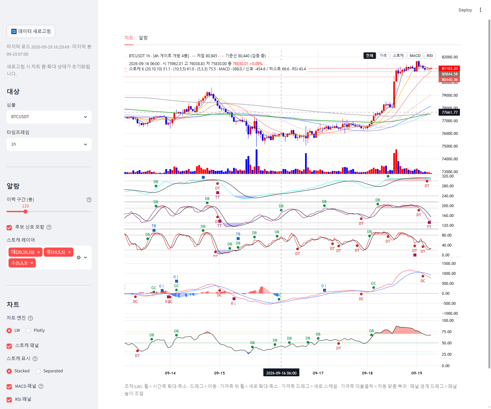
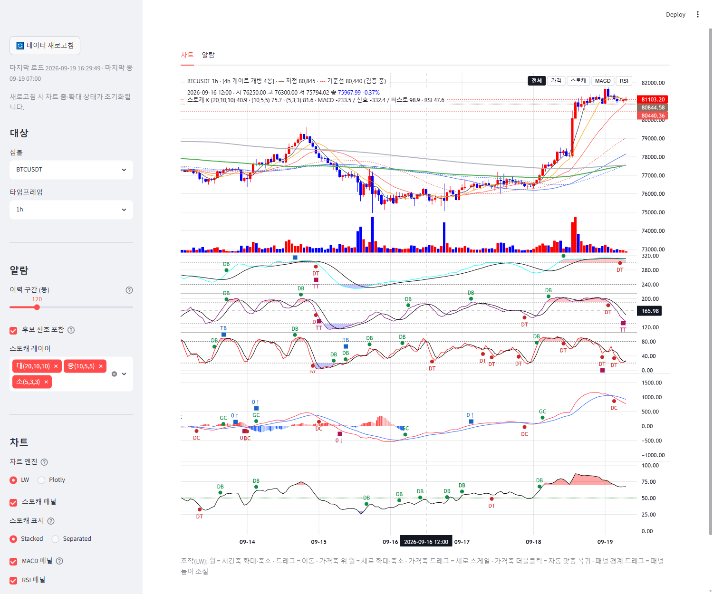

# signal-alarm 브랜치 — LW 차트 날짜 표기 한국식 + 크로스헤어 상시 표시 보고

작성 2026-09-19. 수정 파일: `charts/lw_builder.py` 만(표시 계층). 정의·알람 무접촉(analysis/·indicators/·config/·display/ 무수정).
테스트 2파일 신규. **적용하려면 실행 중인 Streamlit 재시작 필요**(charts 모듈 변경). 검증은 별도 포트 8502 재시작으로 했다.

## 1. 커밋 (분리)

| 구분 | 해시 |
|---|---|
| 날짜 표기 한국식(툴팁·시간축 눈금) + node 실행 단위 테스트 | 0762085 |
| 크로스헤어 상시 표시 + 커서 봉 정보 오버레이 + 테스트 | cca957a |
| 보고·스크린샷 2장 | (이 문서 커밋) |

## 2. 날짜 표기 (§1)

- **툴팁(크로스헤어 시간 라벨, `localization.timeFormatter`)**: `2026-05-12 13:05` 형식. 초는 생략.
  **일봉 이상 TF(`1d·3d·1w·2w·1M` 등 d/w/M 접미)는 시:분을 생략**해 `2026-05-12` — 봉 시각이 항상 00:00 이라 정보가 없고
  자리만 차지하기 때문(판단 근거). 규칙은 `tooltip_shows_clock(interval)` 한 곳에 두고 구간별 테스트로 고정했다.
  LW 가 BusinessDay 객체(`{year, month, day}`)를 넘기는 경우도 같은 문자열로 처리.
- **시간축 눈금(`timeScale.tickMarkFormatter`)**: LW 의 밀도 단계(tickMarkType)는 그대로 두고 순서만 한국식.
  Year `2026` · Month `2026-05` · DayOfMonth `05-12` · Time `13:05` · TimeWithSeconds `13:05:07`. 0 패딩.
- 구현: `createChart` 의 옵션은 JSON 으로 넘기므로 함수를 실을 수 없어, 생성 직후 `chart.applyOptions` 로 두 포맷터를 적용.
  포맷 함수는 `TIME_FORMAT_JS` 문자열 하나에 모아 두고 테스트가 **node 로 실제 실행**해 분봉/시간봉/일봉 출력을 대조한다
  (node 없으면 skip). 이 PC 는 node v24.12.0.
- **시간대: UTC — 바꾸지 않았다.** 프레임 인덱스는 바이낸스 `open_time` 을 naive 로 두는 UTC 이고(`_unix_seconds` 가 tz 부여·이동 없이
  epoch 로 변환), LW 도 UTC 로 그린다. 알람 탭의 "마지막 봉 09-19 05:00" 과 차트 툴팁 "2026-09-19 05:00" 이 같은 벽시계임을
  테스트로 고정(`test_time_axis_stays_utc_and_matches_alarm_timestamps`). 이번 검증 시각 16:27 KST 에 마지막 봉 07:00 → UTC 확인.
  **제안(미구현)**: 사용자가 KST 로 착각하지 않도록 차트 캡션 끝이나 시간축 옆에 "UTC" 표기를 한 글자 붙이는 것.
  시각 값 자체는 알람·정의와 어긋나면 안 되므로 변환하지 않는 것이 맞다.

## 3. 크로스헤어 (§2)

- **모드 확인**: 기존 `crosshair.mode` 는 이미 `0`(Normal) 이었다 — Magnet(1) 이 아니었으므로 모드 변경은 없고,
  `vertLine`/`horzLine` 의 `visible`·`labelVisible` 을 명시적으로 켰다(기본값과 같지만 요건을 코드에 고정).
  어느 pane 위에서든 수직선은 전 pane 을 관통하고, 수평선·가격 라벨은 커서가 있는 pane 의 축에, 시간 라벨은 시간축에 붙는다(§5 실측).
- **커서 봉 정보 오버레이(`#lw-ohlc`)**: 가격 pane 좌상단, 게이트·기준선 캡션 줄 **바로 아래**(캡션 top 6px + 실측 높이 22.5px →
  오프셋 24px, top 30px; 실측 `overlap: false`). 1줄째 `2026-09-16 06:00 · 시 75962.01 고 76038.83 저 75830.00 종 76030.01 +0.09%`
  — 종가·변화율은 캔들 색 토큰(`CANDLE_OPTS.upColor/downColor`)으로, 변화율은 **직전 봉 종가 대비**, 가격 포맷은 축과 같은
  `series.priceFormatter()`. 커서를 벗어나면 마지막 봉 값(실측: `2026-09-19 07:00 …`).
- **하위 pane 값도 구현함(§2 선택 항목)**: 2줄째 `스토캐 K (20,10,10) 31.1 · (10,5,5) 61.0 · (5,3,3) 75.5 · MACD -388.0 / 신호 -454.6 /
  히스토 66.6 · RSI 43.4`. 스토캐는 오프셋 배치된 shifted 값에서 오프셋을 빼 0~100 로 되돌린 K. 꺼진 pane 은 항목이 빠진다.
  값은 hover 이벤트의 seriesData 가 아니라 PAYLOAD 의 시간→값 맵에서 읽으므로 hover 와 "커서 밖 = 마지막 봉" 이 같은 경로다.
- pane 단독 모드에서 캡션이 띠 아래로 내려갈 때 오버레이도 같은 오프셋으로 따라 내려간다(`applySolo`).

## 4. 테스트

- `tests/test_lw_time_format.py` 6건(+파라미터 10): node 실행 포맷 대조(시간봉 시:분 / 일봉 생략 / BusinessDay), 구간별 시계 규칙,
  눈금 5단계·0패딩, UTC 불변·알람 시각 일치, HTML 배선(포맷터·플래그·시간대 옵션 부재).
- `tests/test_lw_crosshair.py` 3건: Normal 모드·선/라벨 옵션, 오버레이 위치·구독·마지막 봉·가격 포맷·변화율·하위 pane 항목·단독 모드 이동, 색 토큰.
- 기존 LW 스모크·게이트 문맥·추적 섹션·알람 탭 테스트 포함 96건 통과.

## 5. 스크린샷 (검증 인스턴스 8502, 2026-09-19 16:27~16:30 KST, 콘솔 에러 0)

| 가격 pane 빈 공간(캔들 위쪽)에 커서 | 스토캐 pane 에 커서 |
|---|---|
|  |  |

- 두 경우 모두 수직선이 전 pane 관통, 커서 pane 의 축에 값 라벨(77661.77 / 165.98), 시간축에 `2026-09-16 06:00` / `2026-09-16 12:00`,
  눈금 `09-14 … 09-19`, 오버레이에 해당 봉의 OHLC·변화율·하위 pane 값.
- 캔들 본체 위에 정확히 커서를 올린 장면은 자동화(요소 중심 hover)로 좌표 지정이 안 돼 찍지 못했다. Normal 모드는 위치와 무관하게
  같은 크로스헤어를 그리고, 오버레이는 커서의 **시간**에 해당하는 봉을 읽으므로(본체 위/빈 공간 구분 없음) 동작은 동일하다.

## 6. 재시작

- 사용자 Streamlit(8501)은 재시작 전까지 이전 표기(영문 눈금, 오버레이 없음). 검증용 8502 는 종료했다.
