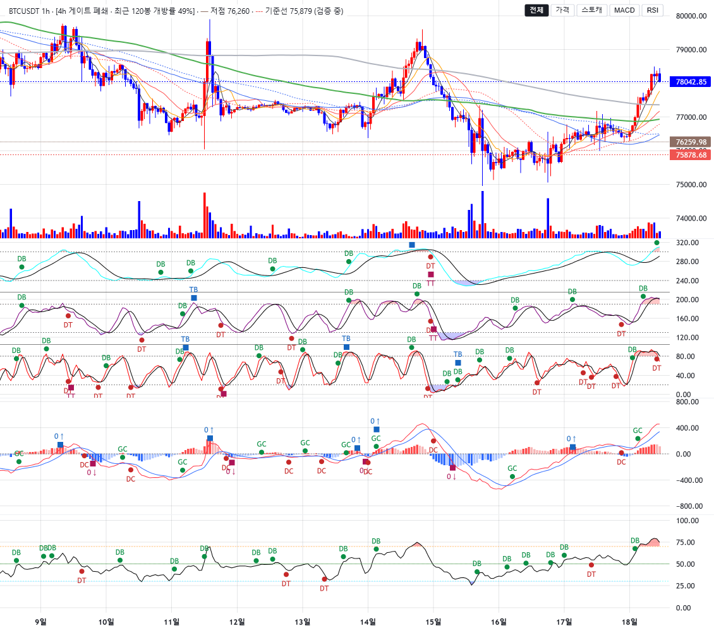
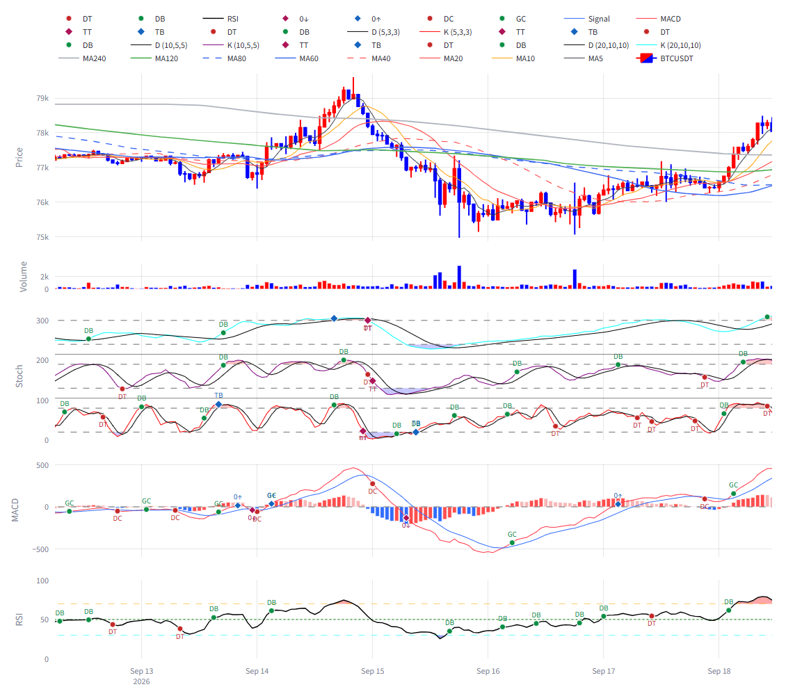

# signal-alarm 브랜치 — LW 차트: 과매수·과매도 영역 음영 이식 보고 + 다이버전스 표시 중단 사유

작성 2026-09-18. `charts/lw_builder.py` + `charts/theme.py` 토큰 + 테스트만. 지표·검출 계산 무접촉, 신규 검출기 없음,
Plotly 경로 무수정. **적용하려면 실행 중인 Streamlit 재시작 필요.** 8501 인스턴스는 이전 코드 상태이며 검증은 별도 포트
8502 로 했다.

## 0. 원본 확인 (Plotly 경로)

| 항목 | Plotly 함수 | 데이터 | 색·투명도 |
|---|---|---|---|
| (a) 스토캐 과매수/과매도 음영 | `add_stacked_stochastic_panel` → `add_masked_fill_segments` (층별 2회) | `stoch_k_shifted_{label}` 와 임계선 `20+offset` / `80+offset` 사이 폴리곤(`fill="tonexty"`), 마스크는 raw `stoch_k_{label}` < 20 / > 80 | `rgba(0, 0, 255, 0.22)` / `rgba(255, 0, 0, 0.22)` |
| (b) RSI 과매수/과매도 음영 | `add_rsi_panel` → `add_masked_fill_segments` (2회) | `rsi` 와 `RSI_PARAMS["oversold"]`=30 / `["overbought"]`=70 사이 | `rgba(0, 0, 255, 0.35)` / `rgba(255, 0, 0, 0.35)` |
| (c) 다이버전스 점선·"상승/하락" 라벨 | **없음** — `charts/plotly_builder.py`(signal-alarm·main 양쪽)에 그리는 코드가 없다 | — | — |

(c) 상세: 저장소에서 "다이버전스"에 해당하는 코드는 두 곳뿐이다.
- `analysis/wave_energy_divergence.py` — **OBV 에너지 다이버전스**(가격 저점 vs OBV) 연구 모듈. validation CSV 를
  소비하는 사후 분석이며 스토캐·RSI 다이버전스가 아니고, 차트에 그리는 코드도 없다(`display/wave_energy_divergence_ui.py`
  는 보고서 섹션 표시 전용, 슬림 앱 미포함).
- `analysis/dynamics_rules.py` — 전환 규칙표의 F6-4c-b("하락 다이버전스")·F6-5c-b("상승 다이버전스") 행과 서술문의
  "상승/하락" 단어. MA 쌍바닥/쌍봉 kind 와 대파동 kind 의 AND 조합 규칙이며 차트 선분을 정의하지 않는다.
  스토캐 피봇 컬럼(`stoch_pivot_low/high_*`)도 Plotly 차트는 그리지 않는다.

## 1. 영역 음영 이식 — 완료 (커밋 `6ff52ec`)

- **채택: 방식 ① BaselineSeries(baseValue=임계값).** 위 구간은 `topFillColor1/2` 만, 아래 구간은 `bottomFillColor1/2` 만
  켜고 반대쪽은 투명, `lineVisible:false`·선 색 투명. 결과는 "시리즈와 임계선 사이만 채움" 으로 Plotly 의
  `add_masked_fill_segments` 폴리곤과 같은 모양이다.
- 스토캐 3중 오프셋 배치와 **충돌 없음**: 층별 baseValue 가 `20/80 + 오프셋`(참조선 값과 동일)이고 채움은 그 층의 K 와
  임계선 사이에 갇힌다(K 는 층 대역 안에만 존재). 방식 ② 는 시도할 필요가 없었다(①이 정확히 동작).
- 음영 시리즈는 K/D 선보다 먼저 추가(아래 레이어), 고정 스케일 목록에 포함. 실측: 스토캐 −8~326.7(0~320 고정 유지),
  RSI −6.3~105.6(0~100 유지), 참조선·분리선·마커(스토캐 234·RSI 72) 불변, 콘솔 에러 0.
- 토큰: `charts/theme.py` `ZONE_FILL_COLORS` 4키(Plotly rgba 문자열 그대로). 빌더는 참조만(테스트가 리터럴 부재 단언).
- 실측 시리즈 옵션(브라우저): 스토캐 base 300/240 · 190/130 · 80/20, 색 위 `rgba(255, 0, 0, 0.22)`/아래 `rgba(0, 0, 255, 0.22)`;
  RSI base 70/30, `0.35`.

### 스크린샷 (BTC 1h — 스토캐 과매도 음영 + RSI 과매도·과매수 음영 구간)

| LW | Plotly |
|---|---|
|  |  |

스토캐 근접: `img/lw5_zones_lw_stoch.png`, RSI 근접: `img/lw5_zones_lw_rsi.png`. LW 창이 더 넓게 보이는 것은 뷰포트
리사이즈 후 봉 간격을 유지하는 LW 특성(기존)이며 이번 변경과 무관.

## 2. 다이버전스 표시 — **중단** (구현하지 않음)

위임장 §2 의 전제 "Plotly 가 그리는 것과 동일한 구간" 이 성립하지 않는다(§0 (c)). Plotly 경로에는 다이버전스 점선도
"상승/하락" 라벨도 없고, 그 구간을 정하는 산출물(컬럼·이벤트)도 스토캐·RSI 에는 없다. 구현하려면 다이버전스 검출기를
새로 써야 하는데 "신규 검출기 작성 금지·재구현 금지" 에 걸린다. 따라서 §2 는 중단하고 결정을 요청한다:

- (a) 첨부 이미지의 다이버전스가 어느 화면(엔진·브랜치·패널)에서 나온 것인지 지정해 주시면 그 산출물을 찾아 소비하겠다.
- (b) 스토캐/RSI 다이버전스 정의(피봇 규칙·비교 창·확정 봉)를 지시받으면 검출기를 **분석 계층**에 별도 위임으로 추가한
  뒤 표시만 이식하겠다(표시 계층 위임 안에서는 정의를 만들지 않는다).
- (c) `analysis/wave_energy_divergence.py` 의 OBV 다이버전스를 뜻하는 것이라면, 그것은 사후 연구 산출물(CSV)이라 라이브
  차트 소비 경로부터 결정이 필요하다.

LW 쪽 표시 방식은 준비돼 있다: 별도 LineSeries(점선, 구간 밖은 whitespace `{time}` 데이터로 비표시) + 끝점 마커 텍스트
("상승"/"하락", 선 위 텍스트 없음). 산출물이 정해지면 그대로 붙인다.

## 3. 테스트

| 묶음 | 결과 |
|---|---|
| tests/test_lw_builder.py (신규 2건: 토큰·임계값·층별 오프셋·하드코딩 부재 / BaselineSeries 배선·순서·고정 스케일 포함) + tests/test_lw_gate_context.py + tests/test_slim_app_smoke.py (Plotly 스모크) | 56 passed |
| 전체 tests/ | 652 passed, 2 failed, 1 skipped — 실패 2건은 test_wave_ruleset_robustness (numpy2/pandas3 기존 회귀, 이번 변경과 무관). 직전 650 → 652 (신규 2건) |

다이버전스 구간 동일성 테스트는 §2 중단으로 작성하지 않았다(비교 대상 없음).

## 4. 커밋

| 구분 | 해시 |
|---|---|
| 음영 | 6ff52ec |
| 다이버전스 | (중단 — 없음) |
| 보고·스크린샷 | (이 문서 커밋) |
