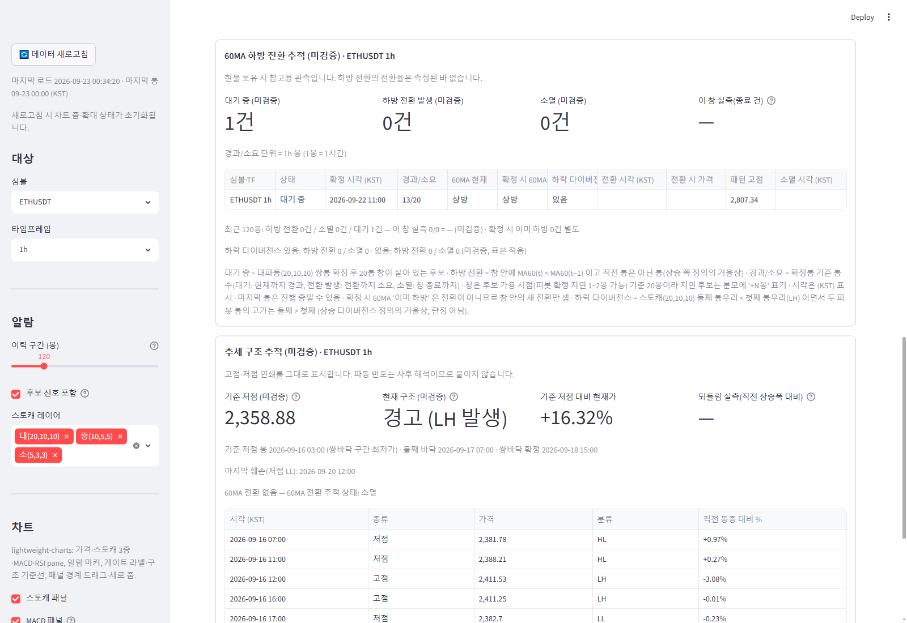

# 60MA 하방 전환 추적 — 현물 보유 경고용 관측 (거울상) 보고

작성 2026-09-22. 단계 A(signal-alarm 표시) + 단계 B(main 알림) 완료. 상승 쪽 로직·정의·파라미터 무변경, 정의 파일·전방 추적 파일 무접촉.
**적용하려면 실행 중인 Streamlit(8501) 재시작 필요**(main·display 모듈 변경). 검증은 별도 포트 8502 재시작으로 했다(종료함).

> 현물 보유 중 청산 판단 **참고용 관측**이다. 숏·선물 진입 신호가 아니며, 모든 표기에 "(미검증)". 상태 기술만("60MA 하방 전환 발생").
> 하방 전환의 전환율은 측정된 바 없다 — 상승 쪽 계측 수치(1h 40.7% / 4h 41.3%)를 이쪽에 쓰지 않았다(테스트가 부재 단언).

## 1. 커밋 (분리)

| 구분 | 브랜치 | 해시 |
|---|---|---|
| A. 표시 모듈 `display/ma60_down_tracker.py` + 알람 탭 배선 + 테스트 12건 | signal-alarm | 68454ff |
| A. 보고·스크린샷 | signal-alarm | (이 문서 커밋) |
| B. 알림 종류 추가(`notify/`), 모듈 체리픽(내용 무변경, sha256 매니페스트) + 테스트 29건(+3) | main | 8ee3cdb (origin/main 푸시 완료) |
| B'. 신규 종류 첫 스캔 = 발송 0건·전량 기록(종류별), `kinds` 필드, 테스트 30건 | main | 0481739 (푸시 완료, 추적 클론 동기화) |
| 추적 클론 동기화(09-21 생존 신호 커밋을 8ee3cdb 위로 rebase → push) | main | 3007e20 |

signal-alarm 은 푸시하지 않았다(이전 라운드 bc4f001 도 미푸시 상태였음). main 의 매니페스트 테스트는 `git show 68454ff:…` 로 blob 을
대조하므로 signal-alarm 을 원격에 올리기 전에는 다른 클론에서 그 대조만 skip 되고(sha256 대조는 항상 수행) 이 PC 에서는 통과한다.

## 2. 정의 — 상승 쪽의 정확한 거울상, 파라미터 신설 없음

| 항목 | 상승 쪽(기존, 무변경) | 하방 쪽(신설) | 출처 |
|---|---|---|---|
| 후보 | 대파동(20,10,10) 쌍바닥 확정 | 대파동(20,10,10) **쌍봉 확정** | **probe 에 쌍봉 경로가 있어 그것을 썼다**: `probe.extract_signals(...)["stoch_tops"]`(확정봉·as-of 가용 시점 known·지연). 알람 계층 DT 검출은 쓰지 않음 |
| 패턴 극점 | 첫~둘째 바닥 구간 low 최소 | 첫~둘째 봉우리 구간 high 최대 | 첫 봉우리 = 앱 검출기 기록 `stoch_dt_first_pos`, 둘째 봉우리 = 확정봉 이하 마지막 피봇 고점(`probe._last_pos_leq`, probe 의 `_tops` 와 같은 규칙). 미기록·순서 역전 건 제외(쌍바닥과 같은 규칙) |
| 전환 | 창 안 MA60(t) > MA60(t−1), 직전 봉은 아님 | 창 안 MA60(t) < MA60(t−1), 직전 봉은 아님 | **MA60 부호를 반전한 프레임**에 `probe.extract_signals` 적용 → `ma60_up`/`ma60_turn`/`ma60_valid` 가 그대로 하방/하방 전환/유효. 표시 계층에 기울기 계산 없음(테스트가 값으로 확인: 유효 구간에서 `MA60 < 직전` 과 정확히 일치, 상승 플래그와 배타) |
| 창·경과/소요·as-of | `lifecycle_rows` (창 [k, k+20], 경과는 확정봉 기준, 가용 지연 '+N봉') | **같은 함수를 거울상 sig 로 호출**하고 방향 라벨만 되돌림('이미 상방'→'이미 하방') | `up.lifecycle_rows` import |
| 기준선 | 패턴 저점 ×0.995(롱 손절 참조) | **두지 않음** | 거울상(×1.005)은 숏 손절 참조값이라 현물 보유 관측에 해당 없음. 위임 §2 열 목록에도 없음 |

## 3. 단계 A — 화면 (알람 탭, 상승 쪽 섹션 바로 아래)

섹션 "60MA 하방 전환 추적 (미검증) · 심볼 TF". 캡션 "현물 보유 시 참고용 관측입니다. 하방 전환의 전환율은 측정된 바 없습니다."
메트릭 5개: 대기 중 / 하방 전환 발생 / 소멸 / **이 창 실측(종료 건)** = 하방 전환 ÷ (하방 전환 + 소멸) — 표시 구간 실측일 뿐이라는 help 문구 /
**이미 하방**(건수만 — 2026-09-23 908b71c 추가: 확정 시 60MA 가 이미 하방이던 후보는 상태 **'해당 없음 (이미 하방)'**, 창과 무관하게 대기·소멸·실측에서
제외. 상승 쪽 '해당 없음 (이미 상방)' 의 거울상으로 같은 함수 `apply_already_status`·`waiting_rows` 를 승계. 원 생애주기는 `_lifecycle` 열에 남아
ledger·하방 전환 알림 불변).
표(최근 120봉 안 가용 후보, 최신순): 심볼·TF · 상태 · 확정 시각 · 경과/소요 · 60MA 현재 · 확정 시 60MA(**'이미 하방'**) · 전환 시각 · 전환 시 가격 · **패턴 고점** · 소멸 시각.
집계 1줄: "최근 120봉: 하방 전환 X건 / 소멸 Y건 / 대기 Z건 — 이 창 실측 X/(X+Y) = P% (미검증) · 확정 시 이미 하방 W건 별도".
차트 가격선·알람 배지·"마지막 봉 알람" 줄에는 넣지 않았다(위임 §2 범위 밖, 표시 전용).

스크린샷 (검증 인스턴스 8502, 2026-09-22 03:31 KST, 콘솔 에러 0) — BNBUSDT 1d: 세 상태(대기 1 · 하방 전환 2 · 소멸 1)와 '이미 하방' 이 한 화면에 있는 셀:


## 4. 단계 B — 알림 (main, notify)

- `display/ma60_down_tracker.py` 를 68454ff 에서 내용 무변경 복사. `notify.CHERRYPICK["display/ma60_down_tracker.py"] = 5a3f32d9…f098`
  (LF 정규화 sha256), `CHERRYPICK_SOURCE_COMMIT_DOWN = "68454ff"`. 테스트가 로컬 파일·원본 blob 을 대조. main 의 `display/ma60_turn_tracker.py`
  (9bb606c 판)는 그대로 — 하방 모듈이 쓰는 함수(`tracker_pipe`·`lifecycle_rows`·포맷 헬퍼)는 양 판에 동일.
- 알림 종류 `ma60_down` = "60MA 하방 전환 발생 (미검증)". `track_candidates` 의 '전환 발생' 행 그대로(전환봉 = known_pos). 메시지 3줄:
  ```
  [BTCUSDT 4h] 60MA 하방 전환 발생 (미검증)
  쌍봉 확정 09-18 17:00 → 하방 전환 09-18 21:00 (소요 1봉)
  가격 80,726 · 패턴 고점 84,968 · 현물 보유 시 참고용 관측 · 하방 전환율 미측정
  ```
- 승계: 대상 9셀(3심볼×1h/4h/1d) · 키 = 심볼|TF|종류|전환봉 UTC(같은 봉 두 후보 → 키 동일 → 실행당 1건, 기존 규칙) · 닫힌 봉만 · 30일 회전/20일 스캔 창.
- **신규 알림 종류 도입 시 폭탄 방지(종류별, 전역 규칙과 별개 — 김박사 지시, main 0481739)**: 그 종류를 처음 스캔하는 실행에서는
  그 종류를 **0건 발송·전량 record-only** 하고 이력 파일 `kinds` 필드에 종류를 적는다(이벤트가 없어도 적음). 다음 실행부터 이력에 없는
  새 이벤트만 발송. 기존 종류는 sent 키의 kind 조각으로 '이미 본 종류' 인정(라이브 이력 확인: ma60_turn 17·structure_ll 13 → 인정, ma60_down 신규).
  전역 최초 실행 제한(발송 성공 0건 → 최근 2봉)은 종전대로 두고 순서는 old → dup → **새 종류 record-only** → 전역 record-only → send.
  8ee3cdb 에서 넣었던 '종류별 발송 성공 기준' 일반화는 되돌렸다. 라이브 첫 실행 예상: 하방 13건 record-only·발송 0건.
  테스트 고정: plan 순수 함수 + 실데이터 2회 실행(1회차 하방 0건·전량 기록·kinds 기록, 2회차 새 하방 전환봉 1건만 발송). 워크플로 파일 무수정.
- `FORBIDDEN_WORDS` 에 "숏"·"청산" 추가(메시지·패키지 본문 부재 단언). 워크플로·fetch·telegram·데이터 소스 무변경.
- 검수: dry-run(9셀, 실데이터) 정상 — 각 셀 events 14~20, 초기 모드 로그 "initial mode for ma60_turn,ma60_down,structure_ll" (빈 이력 기준).
  스케줄 실행은 다음 실행부터 main 3007e20 으로 돈다(보고 시점 03:57 KST 까지 새 main 으로 돈 실행 없음 — 마지막 실행 09-21 16:29 UTC, 9778b2c).
  참고: `gh run list` 기준 최근 스케줄 실행이 09-21 04:48 / 10:14 / 16:29 UTC 세 번뿐 — 15분 cron 이 GitHub 쪽에서 대부분 건너뛰어지고 있다(이 라운드와 무관, 별도 확인 필요).
  Secrets 는 등록된 상태 그대로.
- 추적 클론: 09-21 19:54 실행의 push 가 DNS 장애(`Could not resolve host: github.com`)로 실패해 로컬 커밋 1개가 남아 있었다(내 푸시와 무관).
  f60873f 재시도 경로와 같은 `pull --rebase --autostash` → push 를 수동 수행해 3007e20 으로 동기화 확인(autostash 적용·충돌 없음, 클론의
  모듈 sha256 = 매니페스트).

## 5. 검수·테스트

signal-alarm `tests/test_ma60_down_tracker.py` 12건:
- import 소비: `probe.extract_signals`·`stoch_tops`·`up.lifecycle_rows`·`up.tracker_pipe` 호출 단언, 재구현 흔적(`compute_*_pivots`·`detect_double_top`·`np.roll`·`shift(`·`rolling(`·`< prev`·`diff(`) 부재, `alarm_signals` 미사용, `OBS_BARS`/`RECENT_BARS` 승계.
- 상승 쪽 무접촉: `display/ma60_turn_tracker.py` = bc4f001 blob, probe = 매니페스트 sha.
- **거울상 대칭**(3 seed × 합성 1,600봉): 가격 반전(고·저 교환·부호 반전)한 프레임의 **상승 추적기** 출력과 원 프레임의 하방 추적기 출력이
  후보 집합·상태·경과/소요·전환/소멸 시각·'이미 하방'↔'이미 상방'·60MA 현재 방향 전건 일치, 패턴 고점 = −패턴 저점, 전환 시 가격 = −가격.
  (스토캐 %K 가 반전 대칭이고 쌍봉 검출기가 쌍바닥 반전 호출로 구현돼 있어 정확히 대응한다.)
- MA 플래그: 하방 = 유효 구간 `MA60 < 직전` 과 배열 동일, 상승·하방 배타, 하방 전환 봉 ∩ 상승 전환 봉 = ∅. 후보 ⊂ `stoch_tops`, 패턴 고점 산식.
- 합성 케이스: 전환(4/20) / 소멸(20/20) / 대기(9/20) / 가용 지연(5/21 (가용 +1봉)) / **확정 시 이미 하방**('이미 하방' 표기, 창 안 새 전환 없음 → 소멸) — 상승 쪽 함수 결과와 라벨 외 동일.
- 표기: 제목·캡션 고정 문자열, 상승 쪽 수치(40.7/41.3/60%) 부재, 권고·방향 어휘("매도·매수·숏·공매도·청산·진입·추천·권고·하라") 본문·요약 텍스트 부재.
- 빈/미준비 프레임 안전, 표시 포맷(패턴 저점·기준선 열 없음), main 배선(상승 섹션 뒤·구조 섹션 앞, 차트 블록·알람 정의 무접촉).

main `tests/test_notify_scanner.py` 30건(+4, 수정 6): 매니페스트(5파일, 하방 모듈은 68454ff 대조), `EV.MD is MD`·`MD.up is MT`, 하방 이벤트 = 추적기 '전환 발생' 행·상승 전환봉과 배타,
메시지 형식(위 예시 그대로, 기준선·상승 수치 부재), 키 규칙(같은 봉 두 후보 → 키 동일, plan 이 1건으로), **신규 종류 첫 스캔 0건 발송(순수 함수·실데이터 2회 실행)**, 이력 왕복(`kinds` 보존·회전 무관), 금지 어휘.

전체 스위트: signal-alarm 28건(하방 12 + 상승 16) 통과. main 워크트리 8ee3cdb 시점 **696 통과 / 1 스킵**, 0481739 시점 **695 통과 / 2 실패 / 1 스킵**(기존 `test_wave_ruleset_robustness` 파일 제외). 실패 2건은 `test_align_gate_6h_coverage`(추적 사이드카 `wave_align_gate_forward.csv` 에 6h 이벤트 없음) — 내 변경을 stash 해도 동일하게 실패, 추적 클론 3727a69/3007e20 커밋이 사이드카를 다시 쓴 뒤의 상태로 notify 와 무관(별도 확인 필요).
스위트가 `validation/wave_final_synthesis.png`·`wave_mm_shadow.csv` 를 재생성하므로 실행 후 `git checkout` 으로 되돌렸다(커밋 무포함).

## 6. 알림 빈도 추정 (실데이터, 2026-09-22 03:3x KST 적재 1,000봉/셀)

| 셀 | 구간(일) | 하방 전환/소멸/대기 | 확정 시 이미 하방 | 하방 전환 건/일 | (상승 전환 건/일) | 최근 120봉 |
|---|---|---|---|---|---|---|
| BTCUSDT 1h | 41.6 | 6/13/0 | 8 | 0.144 | 0.192 | 0/1/0 |
| ETHUSDT 1h | 41.6 | 9/10/0 | 4 | 0.216 | 0.216 | 0/2/0 |
| BNBUSDT 1h | 41.6 | 6/14/0 | 9 | 0.144 | 0.144 | 0/2/0 |
| BTCUSDT 4h | 166.5 | 7/13/0 | 5 | 0.042 | 0.042 | 1/0/0 |
| ETHUSDT 4h | 166.5 | 7/10/0 | 7 | 0.042 | 0.042 | 1/0/0 |
| BNBUSDT 4h | 166.5 | 7/10/0 | 4 | 0.042 | 0.066 | 0/1/0 |
| BTCUSDT 1d | 999 | 8/14/1 | 4 | 0.008 | 0.007 | 0/0/1 |
| ETHUSDT 1d | 999 | 5/16/0 | 8 | 0.005 | 0.008 | 0/2/0 |
| BNBUSDT 1d | 999 | 7/14/1 | 6 | 0.007 | 0.007 | 2/1/1 |
| **9셀 합** | | | | **≈0.65건/일** | (≈0.72) | |

→ 하방 전환 알림은 **하루 약 0.65건(주 4~5건)**, 1h 셀이 0.50/일로 대부분, 4h 0.13/일, 1d 0.02/일. 상승 쪽(0.72/일)과 같은 자릿수.
같은 봉 두 후보(키 동일)는 1건으로 접히므로 실제는 이보다 조금 적다(BTC 4h 1,000봉에서 6건 중 1쌍). 판정 아님 — 빈도 참고치.
창 안 하방 전환율(이 창 실측)은 1h 30~47%, 4h 35~41%, 1d 24~36% 로 나왔으나 **탐색 표본의 참고치**이며 계측·검정된 값이 아니다(캡션 그대로).

## 7. 한계·남은 결정

- 하방 전환율 측정은 하지 않았다(위임 범위 밖). 상승 쪽 계측 스크립트를 거울상으로 돌리는 것은 별도 위임 사항.
- 신규 종류 첫 스캔 규칙은 지시대로 반영(0481739). 빈 이력에서의 첫 실행은 이제 모든 종류가 '첫 스캔' 이라 발송 0건이고, 두 번째 실행부터 전역 규칙(최근 2봉)이 적용된다 — 종전보다 보수적.
- main 의 `test_align_gate_6h_coverage` 2건 실패(추적 사이드카 상태, 이 라운드와 무관) 확인 필요.
- 섹션 위치는 상승 섹션 "옆" 을 바로 아래로 해석했다(표 폭 때문에 좌우 병치는 열이 잘림).
- 상승 쪽 표시 모듈의 main 판(9bb606c)과 signal-alarm 판(bc4f001, 기울기 블록 import 3줄)은 여전히 다르다 — 하방 모듈이 쓰는 함수는 동일하므로 영향 없음.


---

## 8. 2차 보완 (2026-09-23) — 하락 다이버전스 열 · 차트 패턴 고점선 · 알림 다이버전스 줄 · ledger 방향 필드

같은 위임장의 재발행분. 1차(§1~§7)에서 빠져 있던 항목만 채웠고 정의·창·전환 규칙·상승 쪽은 그대로다.
**적용하려면 실행 중인 Streamlit(8501) 재시작 필요** — `scripts/run_app.ps1` (display·charts·main 모듈 변경). 검증은 8502 별도 인스턴스로 했고 종료했다.

### 8.1 커밋 (분리)

| 구분 | 브랜치 | 해시 |
|---|---|---|
| A. `display/ma60_down_tracker.py` 하락 다이버전스 열·코호트 줄·차트 고점선, `charts/lw_builder.py` down_tracker_lines, `main.py` 배선, 테스트 16건 | signal-alarm | a2b7812 |
| A. 보고·스크린샷 | signal-alarm | (이 문서 커밋) |
| B. 모듈 체리픽(a2b7812, sha256 `13d02dc0…05a3`), 알림 메시지 다이버전스 줄, ledger 하방 행(direction), 테스트 36건 | main | 0619d53 (origin/main 푸시, 추적 클론 `WaveEnergyHelper-tracking` ff 동기화 확인 = 0619d53) |

### 8.2 하락 다이버전스 열 — 상승 단일 정의의 거울상

| | 상승(`display/divergence_flag.py`, main 870f025, 무변경) | 하락(`ma60_down_tracker.bearish_divergence_flags`) |
|---|---|---|
| 스토캐 극점 비교 | 검출기 `stoch_db_kind == "HL"` (둘째 저점 > 첫째) | 검출기 `stoch_dt_kind == "LH"` (둘째 봉우리 < 첫째; 쌍봉 검출기가 쌍바닥 반전 호출이라 kind 라벨도 반전) |
| 가격 피봇 봉 비교 | 두 피봇 봉 **저가**, 둘째 < 첫째 | 두 피봇 봉 **고가**, 둘째 > 첫째 |
| 피봇 위치 p1·p2 | probe cands | 하방 cands(`extract_mirror_signals`, 1차와 동일) |

새 파라미터 없음, 정의 파일·상승 쪽 함수 무접촉(라벨 "있음/없음" 만 import). 테스트: 합성 3 seed 에서 **원 프레임의 하락 플래그 == 가격 반전 프레임에 상승 단일 정의를 적용한 플래그** 가 전 건 일치(값까지). 열 이름은 "하락 다이버전스"(상승 쪽 "다이버전스" 와 같은 자리 = 확정 시 60MA 뒤), 집계 줄 "하락 다이버전스 있음: 하방 전환 X / 소멸 Y · 없음: …(미검증, 표본 적음)" 은 상승 쪽 형식 그대로.

### 8.3 차트 — 대기 중 후보 패턴 고점선

`down_tracker_reference_lines(frame)` → 대기 중 후보당 점선 1개(색 `#E64A19` 주황, 상승 쪽 보라/청록·구조 기준선 갈색/적색과 구분). 기준선(×1.005)은 두지 않으므로 선은 하나뿐.
`build_lw_html/render_lw_chart(down_tracker_lines=…)` 인자 추가 — 가격선 payload 에 합치고 캡션 조각 " · 하방 추적 ─ 고점 N (미검증)" 을 붙인다. 인자 없으면 HTML 동일(테스트). 8502 검증: ETHUSDT 1h 캡션 `… ┄ 기준선 2,702 (검증 중) · 하방 추적 ─ 고점 2,807 (미검증) (KST)`, 콘솔 에러 0.

### 8.4 알림(main) — 메시지·ledger

메시지(위임 예시 형식, `notify/events.py`):
```
[BTCUSDT 4h] 60MA 하방 전환 발생 (미검증)
쌍봉 확정 09-18 17:00 → 전환 09-18 21:00 (소요 1봉)
가격 80,726 · 패턴 고점 84,968 · 하락 다이버전스 있음
참고: 현물 보유 시 관측용
```
다이버전스 값은 하방 모듈 행의 열 라벨 그대로(이벤트 계층 재계산 없음). 쌍봉 후보 알림은 추가하지 않았다. 종류 `ma60_down` 은 라이브 이력(notify-state 62ff0d0)에 이미 `kinds` 로 기록돼 있고(09-21 20:31 UTC 첫 스캔, 13건 record-only·발송 0) 이번 변경은 메시지 형식뿐이라 신규 종류 폭탄 규칙과 무관 — 다음 실행부터 새 하방 전환만 발송된다(기존 규칙).

ledger(`notify/ledger.py` · `history.py` · `scanner.py`): 하방 후보 종료 행을 같은 ledger 에 `direction: "down"`, `pattern_high`, `already_down`, `divergence`(하락) 로 기록. 상승 행은 키 집합·순서 종전 그대로(direction 키 없음 = 상승, CSV 내보내기에서만 "up"). 중복 키는 상승 행 종전 형식, 하방 행만 `|down` 접미 — 같은 확정봉의 상승·하방 행이 충돌하지 않음(테스트). `summary(rows, direction)` 로 방향별 집계, 로그 `up=… down=…`. 라이브 ledger 는 since 09-21 20:31 UTC 이후 종료 후보가 아직 없어 0행.
dry-run(12셀 실데이터, 빈 이력): 각 셀 정상, 오류 0. `.github/workflows/notify_scan.yml`·Secrets 무접촉.

### 8.5 테스트

- signal-alarm `tests/test_ma60_down_tracker.py` 16건 통과: 1차 12건 + 하락 다이버전스 거울상(합성 `kind`/고가 조합, 반전 프레임 단일 정의와 일치) · 열 위치/코호트 줄 · 고점선(대기 중만·1선·구분 색·금지 어휘) · LW HTML(없으면 동일, 캡션·payload, 상승 추적선과 병행) · main 배선.
  **1차 테스트 4건이 실패하고 있었다**(대칭 3 seed + MA 플래그): 원인은 스토캐 쌍봉/쌍바닥 정의 교체(signal-alarm ee2ba79, 폭 기준)로 1,600봉 합성 표본의 쌍봉 확정이 8~10건으로 줄어 밀도 임계(≥20)가 낡은 것. 임계를 ≥8 로 교정했고 대칭 검사 자체는 전 건 일치. 같은 원인으로 `tests/test_divergence_flag.py` 1건(≥20)도 변경 전부터 실패 — 상승 쪽 파일이라 손대지 않았다.
- 관련 스위트(하방·상승 추적·LW·구조 마커·divergence·slim smoke) 95 통과 / 1 실패(위 divergence 임계, 기존).
- main `tests/test_notify_scanner.py` 36건 통과(+1 하방 ledger, 수정 4). 매니페스트는 a2b7812 blob 대조.

### 8.6 알림 빈도 추정 — 최근 90일, 9셀 (실데이터 2026-09-23 00:2x KST, 닫힌 봉, 키 = 전환봉)

| 셀 | 90일 쌍봉 확정 | 하방 전환 키 | 그중 하락 다이버전스 있음 | (상승 전환 키) |
|---|---|---|---|---|
| BTCUSDT 1h | 14 | 5 | 1 | 1 |
| ETHUSDT 1h | 12 | 6 | 3 | 6 |
| BNBUSDT 1h | 14 | 6 | 2 | 5 |
| BTCUSDT 4h | 3 | 3 | 2 | 2 |
| ETHUSDT 4h | 3 | 2 | 1 | 2 |
| BNBUSDT 4h | 4 | 4 | 1 | 1 |
| BTCUSDT 1d | 1 | 0 | 0 | 0 |
| ETHUSDT 1d | 2 | 0 | 0 | 0 |
| BNBUSDT 1d | 0 | 0 | 0 | 1 |
| **9셀 합** | 53 | **26 → 0.29건/일** (1h 0.19 · 4h 0.10 · 1d 0.00) | 10/26 | 18 → 0.20건/일 |

→ 하방 전환 알림 **하루 약 0.3건(주 2건)**. 1차 추정(0.65/일, 1,000봉·구 검출기)보다 낮은 이유는 검출기 정의 교체(ee2ba79)로 후보 자체가 줄었고 창이 최근 90일로 고정됐기 때문. 판정 아님 — 빈도 참고치.

### 8.7 스크린샷 (8502, 2026-09-23 00:35 KST, 콘솔 에러 0) — ETHUSDT 1h: 대기 중 1건, '하락 다이버전스' 열 "있음", 집계·코호트 줄



### 8.8 남은 것

- 하방 전환율 계측은 여전히 미수행(위임 범위 밖). 상승 쪽 다이버전스 정의 파일에 하락 쪽 정의 문구를 추가하는 것은 정의 파일 무접촉 제약으로 하지 않았다(정의는 모듈 독스트링·이 보고 §8.2 에 기록).
- `tests/test_divergence_flag.py` 임계 1건(상승 쪽, ee2ba79 영향)과 `tests/test_page_render_smoke.py` 2건(시드 표본에 상승 후보가 안 잡힘)은 이 라운드 전부터 실패 — 상승 쪽 파일이라 미수정.
