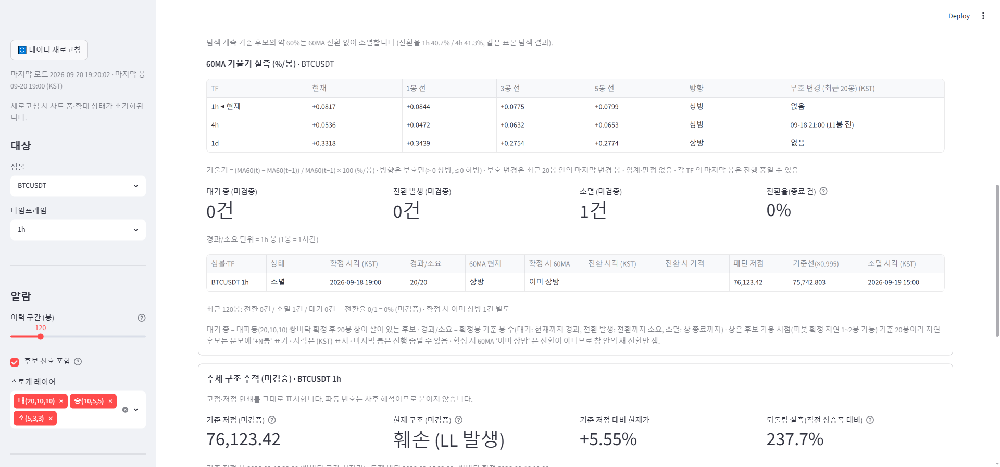

# signal-alarm 브랜치 — 60MA 기울기 실측 표시 (관측 전용 · 알림 제외) 보고

작성 2026-09-20. 신설 `display/ma60_slope.py`(계산·다중 TF·표시), `display/ma60_turn_tracker.py` 는 섹션 안 배선 3줄만
추가, `tests/test_ma60_slope.py` 10건. main.py·정의 파일(analysis/·indicators/·config/)·알람 신호·게이트 무접촉,
알림 대상 추가 없음. **적용하려면 실행 중인 Streamlit(8501) 재시작 필요**(display 모듈 변경). 검증은 별도 포트 8502 로 했다.

## 1. 표시 내용 (60MA 상방 전환 추적 섹션 상단 블록 "60MA 기울기 실측 (%/봉)")

- 기울기 = (MA60(t) − MA60(t−1)) / MA60(t−1) × 100, 단위 %/봉, 소수 4자리·부호 표기.
- 표 1행 = TF: 현재 · 1봉 전 · 3봉 전 · 5봉 전 · 방향 · 부호 변경(최근 20봉, KST).
  - 방향은 **부호만**: > 0 상방, ≤ 0 하방(60MA 상방 전환 추적의 `MA60(t) > MA60(t−1)` 규칙과 같은 기준, 판정 기준 변경 아님).
  - 부호 변경 = 최근 20봉 안에서 방향이 마지막으로 바뀐 봉의 시각 + "(N봉 전)". 없으면 "없음". NaN 구간은 건너뜀.
- **임계값·판정·예측 표기 없음** — "평평/임박/곧 돈다/예측/완만" 어휘는 표시 문자열 어디에도 없고 테스트가 부재를 단언한다
  (`FORBIDDEN_WORDS`). 각주에 산식·부호 규칙·"임계·판정 없음"·"마지막 봉은 진행 중일 수 있음" 명기.
- 기존 후보 표의 "60MA 현재: 상방/하방" 열은 그대로.

## 2. 다중 TF 요약 — 1h·4h·1d 모두 표시

- 현재 TF 는 적재된 프레임을 재사용(재fetch 없음, "◀ 현재" 표시). 다른 두 TF 는 기존 로딩 경로
  `display.asof.fetch_ohlcv_bare`(data/binance `fetch_klines` st.cache_data ttl=600) → `indicators.moving_averages.add_moving_averages`
  로 **MA 까지만** 계산(스토캐·MACD·RSI 없음). 실측 비용: 두 TF 합쳐 첫 로드 ≈ 1.3초(fetch 지배), 캐시 히트 rerun 은 무시 가능
  → 1h·4h·1d 전부 표시(축소 사유 없음).
- 현재 TF 가 요약 3종 밖(예: 15m·3h)이면 그 TF 행을 맨 앞에 더한다. 어느 TF 로딩이 실패하면 그 행만 "—"(알람 탭은 깨지지 않음).

## 3. 스크린샷 (검증 인스턴스 8502, 2026-09-20 19:20 KST, 콘솔 에러 0) — BTCUSDT 1h

| TF | 현재 | 1봉 전 | 3봉 전 | 5봉 전 | 방향 | 부호 변경 |
|---|---|---|---|---|---|---|
| 1h ◀ 현재 | +0.0817 | +0.0844 | +0.0775 | +0.0799 | 상방 | 없음 |
| 4h | +0.0536 | +0.0472 | +0.0632 | +0.0653 | 상방 | 09-18 21:00 (11봉 전) |
| 1d | +0.3318 | +0.3439 | +0.2754 | +0.2774 | 상방 | 없음 |

4h 의 부호 변경 09-18 21:00 은 60MA 상방 전환 추적의 같은 셀 '전환 발생' 봉(09-18 21:00 KST)과 일치한다 — 같은 부호 규칙이므로 당연한 대조.

## 4. 테스트

`tests/test_ma60_slope.py` 10건: 부호·스케일(100→101 = +1.0 %/봉, −0.5, 0 → 하방, NaN → —), pd.NA·짧은 프레임, 1·3·5봉 오프셋
매핑, 부호 변경 창 안(9봉 전)/밖(24봉 전 → 없음)·마지막 변경·NaN 건너뜀, 다중 TF(현재 TF 재사용·다른 TF 로더 호출·실패 행 "—"·
표 형식), 기존 bare fetch 경로·MA 만 계산, 판정·예측 어휘·임계 부재, 정의·알람·게이트 무접촉(import 단언), 섹션 배선·main 무변경.
전체 스위트 결과는 §5.

## 5. 커밋 · 재시작 · 전체 테스트

- 커밋 1개(이 보고·스크린샷 포함).
- 사용자 Streamlit(8501)은 재시작 전까지 이전 화면(기울기 블록 없음). 검증용 8502 는 종료했다.
- 전체 테스트(signal-alarm): **725 통과 / 1 스킵 / 2 실패** — 실패 2건은 기존 `test_wave_ruleset_robustness`(numpy 2 / pandas 3 회귀, 무관).
