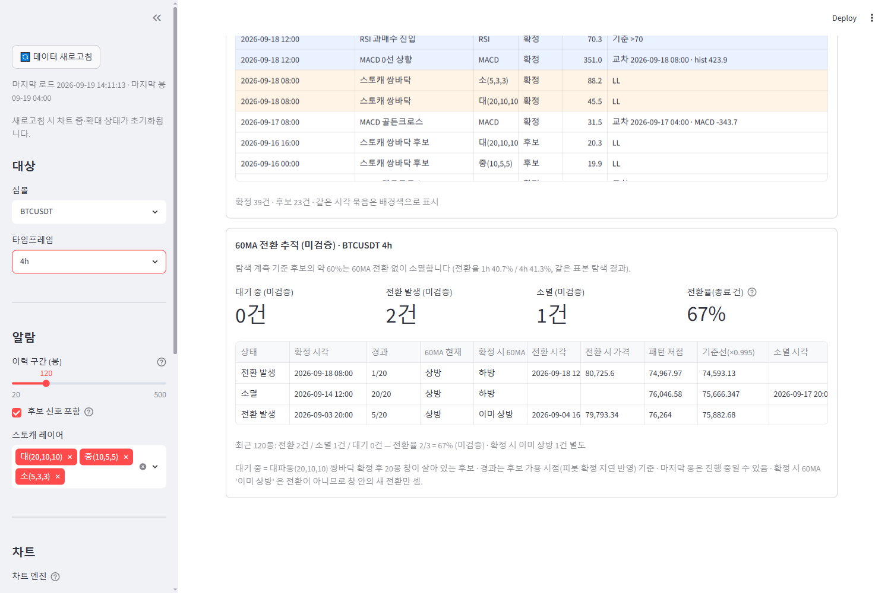
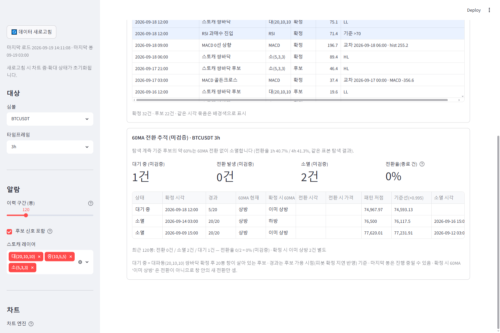
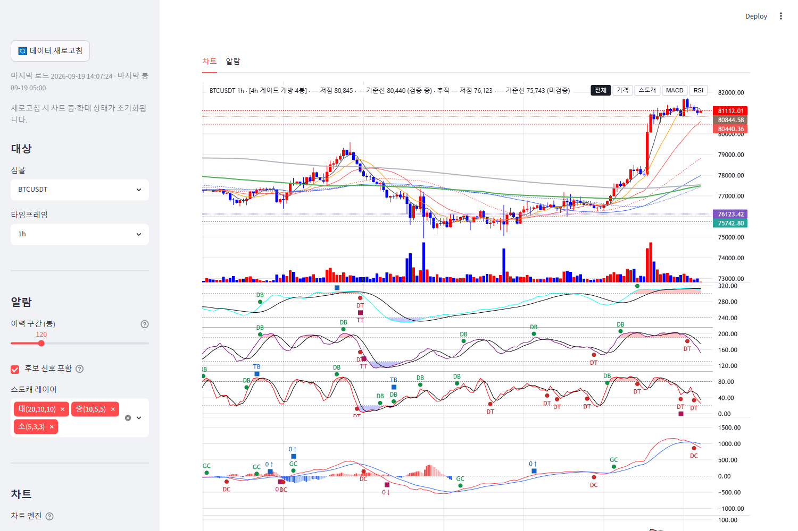
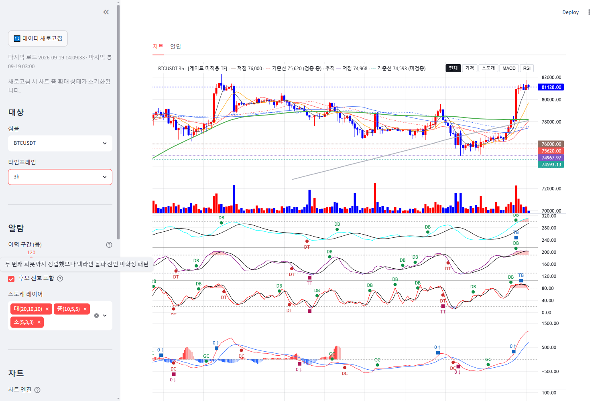

# signal-alarm 브랜치 — 60MA 전환 추적 표시 (미검증 · 관측 전용) 보고

작성 2026-09-19. 표시 계층 신설: `display/ma60_turn_tracker.py`(알람 탭 섹션 + 차트 가격선 공급),
`charts/lw_builder.py`(가격선·캡션 선택 인자), `main.py`(배선), 테스트 1파일. 알람·지표·게이트 정의 무접촉
(analysis/·indicators/·config/ 무수정), 알람 푸시 대상 미포함, 파라미터 고정(20봉·60MA).
**적용하려면 실행 중인 Streamlit 재시작 필요**(main·display·charts 모듈 변경). 검증은 별도 포트 8502 재시작으로 했다.

> 이 표시는 **미검증**이다. 검정은 2027-03 이후 사전등록 스펙(docs/CANDIDATES_POST_2027_03 후보 1, 원격 main)
> 으로 수행한다. 모든 표기에 "(미검증)" 라벨이 붙고 "진입/매수" 권고 표현은 없다("진입" 대신 "전환 발생").

## 1. 커밋 (분리)

| 구분 | 해시 |
|---|---|
| 계측 스크립트 체리픽 `validation/wave_ma60_turn_probe.py` (origin/main 26dfe9c, 내용 무변경) | 880f7ca |
| LW 차트: 추적 가격선·캡션 선택 인자(`tracker_lines`, 없으면 출력 불변) | 546984d |
| 추적 섹션 모듈 + 알람 탭·차트 배선 + 테스트 14건 | 517214d |
| 보고·스크린샷 4장 | (이 문서 커밋) |

## 2. 검출 로직은 import 로만 소비 (제3의 구현 없음)

- `display/ma60_turn_tracker.py` 는 `import validation.wave_ma60_turn_probe as probe` 후
  `probe.extract_signals`(대파동 쌍바닥 후보·as-of 가용 시점 known·패턴 저점·MA60 방향/전환 플래그),
  `probe.OBS_BARS`(20), `probe.BUFFER`(0.005, SS 승계)만 쓴다. 이 모듈에 남는 것은 창 `[k, k+20]` 안의 첫 전환
  탐색과 경과 봉 수 계산뿐이며, **테스트가 합성 프레임에서 `probe.simulate` 의 후보 상태(ENTERED/BUSY→전환 발생,
  EXPIRED→소멸, 전환 시각 동일)와 일치함을 단언**한다.
- 체리픽 동일성: `CHERRYPICK_PROBE` sha256(LF) `95cc6bef…8bc3d` + `git show 26dfe9c:validation/wave_ma60_turn_probe.py`
  blob 대조 테스트. import 경로 단언 테스트(`test_tracker_imports_probe_and_does_not_reimplement_detection`)는
  표시 모듈 본문에 피봇·쌍바닥·MA 기울기 계산 흔적(`stoch_pivot`, `compute_series_pivots`, `shift(`, `np.roll` 등)이
  없음을 함께 확인한다.
- 계측 스크립트는 import 시 `warnings`/`logging` 을 전역으로 끈다(배치용). 표시 모듈이 import 직후 원상 복구하며
  테스트로 고정(모듈 리로드 전후 `logging.root.manager.disable`·`warnings.filters` 동일). 파일은 무변경.
- `extract_signals` 는 가격 10MA 쌍봉 컬럼(`ma10_dt`)도 요구하므로 앱 프레임에 기존 검출기 `indicators.ma_patterns.add_ma_patterns`
  를 한 번 더 적용한다(`st.cache_data`, 1,000봉 기준 첫 계산 ≈1.3초, 이후 rerun 캐시 히트).

## 3. 표시 내용 (알람 탭 별도 섹션 "60MA 전환 추적 (미검증)")

- 상단 고정 캡션: "탐색 계측 기준 후보의 약 60%는 60MA 전환 없이 소멸합니다 (전환율 1h 40.7% / 4h 41.3%, 같은 표본 탐색 결과)."
- 메트릭 5개: 대기 중 / 전환 발생 / 소멸 (각 "(미검증)") / 전환율(종료 건) = 전환 ÷ (전환+소멸) / **이미 상방**(건수만 — 2026-09-23 908b71c 추가).
- 표(최근 120봉 안에 가용된 후보, 최신순): 상태 · 확정 시각 · 경과(N/20) · 60MA 현재 · 확정 시 60MA(**'이미 상방'** 별도 표기)
  · 전환 시각 · 전환 시 가격(전환봉 종가) · 패턴 저점 · 기준선(×0.995) · 소멸 시각.
  - **대기 중** = 쌍바닥 확정 후 20봉 창이 살아 있는 후보. 경과는 후보 가용 시점(피봇 확정 지연 반영) 기준.
  - **전환 발생** = 창 안에 MA60(t) > MA60(t−1) 이고 직전 봉은 아닌 봉이 나온 건("진입"이라 쓰지 않음).
  - **소멸** = 창 20봉이 모두 지나도록 전환 없음.
  - '이미 상방'(확정 시 60MA 가 이미 상방) 후보는 상태를 **'해당 없음 (이미 상방)'** 으로 두고(창 진행 중이든 끝났든 같음) 대기·소멸·전환율에서
    뺀다 — 건수만 메트릭 '이미 상방'·집계 줄에 별도(2026-09-23, 908b71c). 창 규칙의 원 생애주기는 내부 열 `_lifecycle` 에 남아 ledger 기록·
    60MA 전환 알림은 종전과 같다(`already_up` 필드로 구분). 차트 기준선도 '대기 중' 행만 긋는다.
- 하단 집계 1줄: "최근 120봉: 전환 X건 / 소멸 Y건 / 대기 Z건 — 전환율 X/(X+Y) = P% (미검증) · 확정 시 이미 상방 W건 별도".
  **이 누적 확인이 표시의 핵심 목적**이다.
- 마지막 봉은 진행 중일 수 있음을 캡션에 명기(알람 패널 관례).

## 4. 차트 연동 (§2, 구현함)

대기 중 후보의 패턴 저점(보라 `#7E57C2` 점선)·기준선 ×0.995(청록 `#26A69A` 파선)를 LW 가격 pane 에 구조 기준선과 같은
방식(가격선 + 축 뱃지, 차트 안 라벨 없음)으로 그린다. 캡션 조각 " · 추적 ─ 저점 76,123 · ┄ 기준선 75,743 (미검증)"
(후보가 여럿이면 최신 1건 값 + "외 N건"). 대기 중 후보가 없으면 HTML 출력이 완전히 불변(테스트 `base == same`).
구조 기준선 색(갈색·적색)과 겹치지 않는 색을 썼고 기존 pane·마커·단독 모드는 무변경.

## 5. 스크린샷 (검증 인스턴스 8502, 2026-09-19 14:07~14:12, 콘솔 에러 0)

현재 데이터에서는 한 심볼·TF 의 최근 120봉 안에 세 상태가 동시에 나오는 셀이 없어(BTC·ETH × 15m~12h 전수 확인)
두 셀로 나눠 찍었다 — BTCUSDT 4h(전환 2 · 소멸 1), BTCUSDT 3h(소멸 2 · 대기 1 + 차트 가격선).

| 알람 탭 · BTCUSDT 4h (전환 발생 2 · 소멸 1 · 전환율 67%) | 알람 탭 · BTCUSDT 3h (대기 중 1 · 소멸 2 · 이미 상방 2) |
|---|---|
|  |  |

| 차트 탭 · BTCUSDT 1h (대기 중 1건 — 보라 저점 76,123 · 청록 기준선 75,743, 구조 기준선 갈색/적색과 구분) | 차트 탭 · BTCUSDT 3h (대기 중 1건 — 추적 캡션 병기) |
|---|---|
|  |  |

## 6. 최근 구간 집계 vs 계측 리포트 전환율 (자릿수 확인)

120봉 창은 셀당 후보가 1~4건이라 비율이 0%·100% 로 튀는 것이 정상이다(누적은 사용자가 시간을 두고 확인). 같은 코드로 적재
프레임 전체(1,000봉)를 집계하면 계측(REPORT_MA60_TURN_PROBE §3: 1h 40.7% / 4h 41.3%)과 같은 자릿수다:

| 셀 | 1,000봉 전환/소멸/대기 | 전환율(종료 건) | 이미 상방 | 최근 120봉 |
|---|---|---|---|---|
| BTCUSDT 1h | 8 / 12 / 1 | 40.0% | 9 | 0 / 0 / 1 |
| ETHUSDT 1h | 10 / 12 / 0 | 45.5% | 10 | 0 / 2 / 0 |
| BNBUSDT 1h | 8 / 9 / 0 | 47.1% | 7 | 1 / 2 / 0 |
| BTCUSDT 4h | 7 / 14 / 0 | 33.3% | 5 | 2 / 1 / 0 |
| ETHUSDT 4h | 7 / 7 / 1 | 50.0% | 5 | 1 / 0 / 1 |
| BNBUSDT 4h | 11 / 7 / 0 | 61.1% | 8 | 3 / 0 / 0 |

1,000봉당 후보 ≈ 20건은 계측의 심볼당 후보 밀도(1h 981건/49.5k봉 ≈ 20/1,000봉)와 일치한다. 판정 아님 — 표기 대조용.

## 7. 테스트

`tests/test_ma60_turn_tracker.py` 14건: 체리픽 sha256·blob 대조, import 소비·재구현 금지, logging 복구, `probe.simulate`
상태 일치(합성 1,600봉), 경과·최근 필터·기준선 산식, 집계(종료 건 기준), 미검증 라벨·권고 어휘 금지, 빈/미준비 프레임 안전,
차트 가격선(대기 중만·색 구분·출력 불변), main 배선, 알람 신호 정의(`analysis/alarm_signals.py`)·알람 패널 무접촉, 표 문자열 포맷.
전체 스위트 결과는 §9.

## 8. 한계·비고

- 120봉 창은 위임대로 고정(사이드바 노출 없음). 셀당 표본이 작아 한 화면의 비율은 참고치이며, 누적 확인이 목적.
- "경과"는 후보 **가용** 시점(known = max(확정봉, 둘째 바닥+2봉)) 기준이라 확정 시각보다 1봉 늦게 세는 경우가 있다(계측과 동일).
- 진행 중인 마지막 봉을 포함해 계산한다(알람 패널 관례). 봉이 닫히기 전에는 상태가 되돌아갈 수 있다.
- 알람 푸시·경고 배지·"마지막 봉 알람" 줄에는 포함하지 않았다(별도 섹션·차트 가격선만).

## 9. 재시작 · 전체 테스트

- 사용자 Streamlit(8501)은 재시작 전까지 이전 화면(섹션·가격선 없음). 검증용 8502 는 종료했다.
- 전체 테스트(signal-alarm, 2회): **678 통과 / 1 스킵 / 2 실패** — 실패 2건은 기존 `test_wave_ruleset_robustness`
  (numpy 2 / pandas 3 의존 회귀, 이 작업과 무관). 1회차에 `test_import_restores_logging_and_warnings` 가 실행 순서 의존으로
  실패해(다른 테스트가 먼저 logging 을 끈 상태) '리로드 전후 동일' 검사로 고친 뒤 2회차 통과. 스위트가 건드린 파일 없음.
