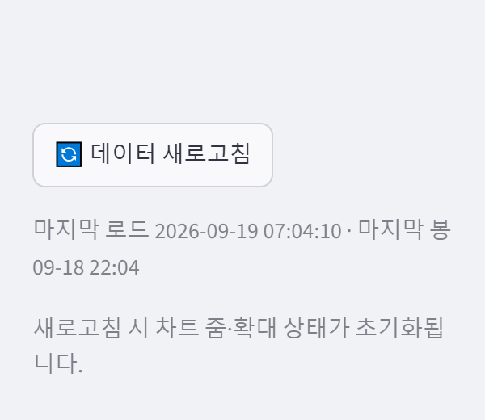

# signal-alarm 브랜치 — 데이터 새로고침 버튼 보고

작성 2026-09-19. 수정 파일: `main.py`, `data/binance.py`(데이터 로딩 계층), `tests/test_refresh_button.py`(신규).
지표·알람·게이트 정의 무접촉, 자동 주기 갱신 없음, 지시 밖 리팩터링 없음.
**적용하려면 실행 중인 Streamlit 재시작 필요**(main·data 모듈 변경). 검증은 별도 포트 8502 재시작으로 했다.

## 1. 커밋

| 구분 | 해시 |
|---|---|
| 버튼 + 캐시 무효화 + 캡션 + 고지 + 테스트 4건 | dac47b6 |
| 보고·스크린샷 | (이 문서 커밋) |

## 2. 현재 캐싱 방식 (§1 확인 결과)

`main.load_frame` 경로의 모든 단계가 **`st.cache_data(ttl=600)`** 이다:

| 단계 | 함수 | 캐시 |
|---|---|---|
| OHLCV 수신 | `data.binance.fetch_klines` (`fetch_klines_paginated` 도 동일, main 은 미사용) | ttl=600, 키 = (symbol, interval, limit) |
| limit | `data.binance.get_auto_limit` | ttl=600 |
| 프레임 변환 | `data.processor.build_dataframe` / `resample_timeframe` | ttl=600, 키 = raw 내용 |
| 지표 | `indicators.add_moving_averages` / `add_macd` / `add_rsi` | ttl=600, 키 = df 내용 |
| 게이트 라벨 | `display.lw_gate_context.gate_row` | ttl=900 (표시 전용, 이번 범위 밖 — 아래 §6) |

즉 **버튼 없이는 심볼·TF 를 바꾸지 않는 한 최대 10분 동안 같은 봉이 rerun 마다 그대로 보인다.** 실측(§4)에서도 위젯
rerun 으로는 로드 시각·마지막 봉이 바뀌지 않았다. 따라서 버튼은 rerun 트리거만이 아니라 **캐시 무효화가 필요**했다.

## 3. 구현

- **버튼** (`main.render_refresh_button`, 사이드바 최상단 — "대상" 헤더 앞): `🔄 데이터 새로고침`. 클릭 시
  `data.binance.clear_klines_cache()` — `fetch_klines.clear()` + `fetch_klines_paginated.clear()` 만 비운다.
  `build_dataframe`·지표 캐시는 입력(raw/df) 내용으로 키가 잡혀 raw 가 바뀌면 자동으로 재계산되므로 건드리지 않았고,
  `st.cache_data.clear()`(전체 삭제)도 쓰지 않았다. 버튼 클릭 자체가 rerun 이고 캐시 삭제가 같은 rerun 의 `load_frame` 보다
  먼저 실행되므로 별도 `st.rerun()` 호출은 없다.
- **마지막 로드 시각**: `data.binance.last_fetch_at(symbol, interval)`. `fetch_klines` 본문(= 캐시 미스일 때만 실행)에서
  성공 시 `time.time()` 을 기록 → "캐시가 아니라 실제로 받은" 시각. 실패(빈 응답·예외)는 기록하지 않는다. 프로세스 전역
  (캐시와 같은 범위).
- **캡션** (버튼 바로 아래, 적재 뒤 placeholder 를 채움): `마지막 로드 2026-09-19 07:04:10 · 마지막 봉 09-18 22:04`.
  로드 시각은 로컬(기동 시각 위젯과 동일 기준), 봉 시각은 데이터 그대로(UTC — 알람 패널 "마지막 봉" 과 같은 표기).
  **기존 신선도 표시와의 중복:** 저장소에 "데이터 신선도" 위젯은 없다. 알람 패널의 "마지막 봉" metric 은 상태 요약의 일부이며
  로드 시각은 어디에도 없었다. 지시대로 버튼 옆에 1줄만 두고 본문에는 아무것도 추가하지 않았다(알람 패널 무수정).
- **고지**: 캡션 아래 `새로고침 시 차트 줌·확대 상태가 초기화됩니다.` — 사실: rerun 이면 `components.html` 이 다시 그려져
  LW 차트(시간축 줌·세로 줌·pane 단독 모드)가 초기 상태로 돌아간다.

## 4. 실측 (8502, 실제 클릭)

| 단계 | 로컬 시각 | 캡션 | 비고 |
|---|---|---|---|
| BTC 1h 초기 적재 | 07:02:09 | 마지막 로드 07:02:09 · 마지막 봉 09-18 22:00 | 알람 패널 metric 도 22:00 |
| **버튼 클릭** | 07:02:21 | 마지막 로드 **07:02:21** · 마지막 봉 09-18 22:00 | 실제 재수신(로드 시각 갱신). 1h 봉은 아직 같은 봉 |
| TF → 1m | 07:02:47 | 마지막 로드 07:02:47 · 마지막 봉 09-18 22:02 | 새 키 → 수신 |
| 위젯 토글 rerun(후보 신호 포함) | 07:03:05 | 마지막 로드 07:02:47 · 마지막 봉 **22:02** (불변) | **캐시 히트** — 22:03 봉이 있어도 안 보임 |
| 65초 대기 후 **버튼 클릭** | 07:04:10 | 마지막 로드 **07:04:10** · 마지막 봉 **09-18 22:04** | 최신 봉까지 갱신 확인 |

콘솔 에러 0, 페이지 에러 0.

## 5. 테스트

| 묶음 | 결과 |
|---|---|
| tests/test_refresh_button.py (신규 4건: 실제 수신 시각 기록·캐시 히트 시 불변·clear 후 재수신·실패 시 미기록 / clear 대상이 fetch 2종뿐 / 캡션 형식 / main 배선·`st.cache_data.clear()`·`st.rerun()`·autorefresh 부재) + test_slim_app_smoke + test_lw_builder | 52 passed |
| 전체 tests/ | **657 passed, 2 failed, 1 skipped** — 실패 2건은 test_wave_ruleset_robustness (numpy2/pandas3 기존 회귀, 무관). 이전 653 → 657(신규 4) |

## 6. 한계 · 남은 것

- 게이트 라벨(`gate_row`, ttl=900)은 표시 전용이고 데이터 로딩 계층이 아니라 건드리지 않았다 — 새로고침 후 최대 15분 동안
  이전 게이트 상태가 남을 수 있다. 포함 여부는 김박사 결정.
- 로드 시각은 프로세스 전역이라 같은 서버의 다른 브라우저 세션이 받은 시각도 반영된다(캐시가 전역인 것과 같은 의미).
- 사용자 Streamlit(8501)은 재시작 전까지 버튼이 없다.
