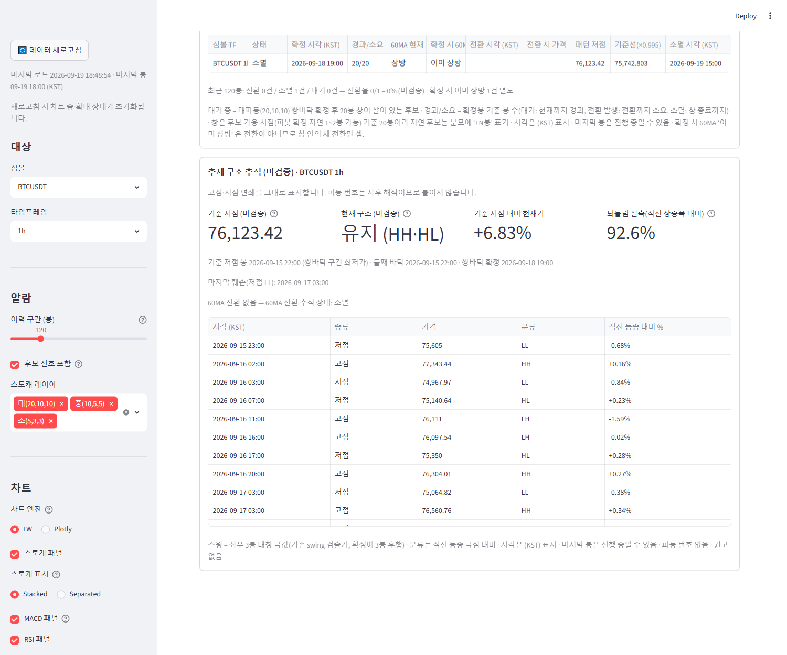
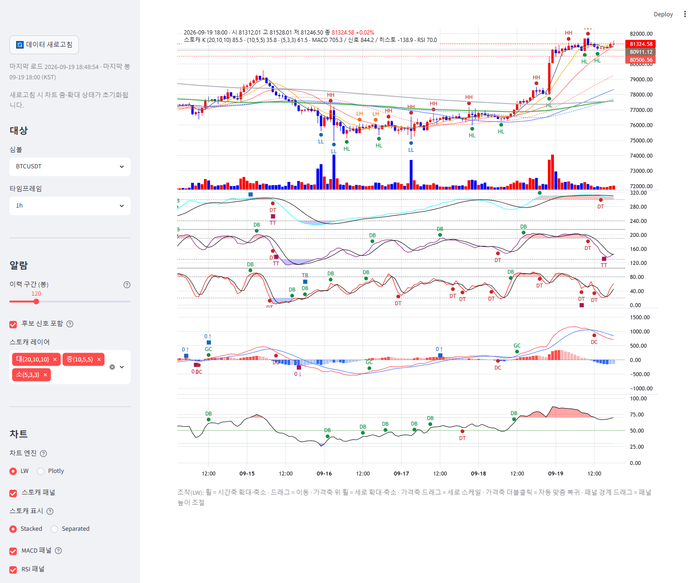

# signal-alarm 브랜치 — 추세 구조 추적 표시 (미검증 · 관측 전용) 보고

작성 2026-09-19. 신설: `display/trend_structure.py`(알람 탭 섹션 + 가격 pane 마커 공급), `charts/lw_builder.py`(마커 훅),
`main.py`(배선), 테스트 2파일. 알람·지표·게이트 정의 무접촉(analysis/·indicators/·config/ 무수정), 알람 푸시 미포함.
**적용하려면 실행 중인 Streamlit 재시작 필요**(main·display·charts 모듈 변경). 검증은 별도 포트 8502 재시작으로 했다.

> 검정이 아니라 관찰 도구다. **파동 번호(1파·2파·3파)를 붙이지 않는다** — 고점·저점 연쇄(HH/HL/LH/LL)와 구조의
> 유지/훼손만 표시한다. 상단 캡션: "고점·저점 연쇄를 그대로 표시합니다. 파동 번호는 사후 해석이므로 붙이지 않습니다."
> 모든 표기에 "(미검증)", 권고·목표가 표현 없음(테스트로 금지).

## 1. 커밋 (분리)

| 구분 | 해시 |
|---|---|
| LW 가격 pane 구조 마커 훅 `structure_markers`(없으면 출력 불변) + 테스트 | 22f99ae |
| 추적 섹션 모듈 + 알람 탭·차트 배선 + 테스트 8건 | c5e950a |
| 보고·스크린샷 2장 | (이 문서 커밋) |

## 2. 검출은 import 로만 소비 (제3의 구현 없음)

- **기준점**: `validation/wave_ma60_turn_probe.extract_signals`(60MA 추적이 체리픽·sha256 고정한 같은 모듈 객체 `MT.probe`)의
  최신 대파동 쌍바닥 후보. 기준 저점 = 그 후보의 **쌍바닥 구간(첫 바닥~둘째 바닥) 최저가**(`pattern_low`, 60MA 추적의
  '패턴 저점'과 같은 값)이며 그 봉을 기준 봉으로 쓴다. 둘째 바닥 봉 자체의 저가를 쓰면 스토캐가 가격보다 늦어 바로 다음
  저점이 LL 로 찍히는 인공물이 생겨(1h 실측) 구간 최저가로 두었다 — 둘째 바닥 시각·확정 시각은 캡션에 병기.
- **스윙**: `analysis.wave_structure_confirmation.find_swing_highs / find_swing_lows / _confirmed / PIVOT(3)` 그대로
  (SS 라운드·구조 기준선과 같은 경로). 신규 검출기 없음 — 테스트가 표시 모듈 본문에 `rolling(`·`shift(`·`def find_swing` 등이
  없음을 단언.
- **60MA 전환 위치**: 60MA 추적의 `lifecycle_rows` 로 같은 후보의 전환봉을 받아 연쇄 표에 `60MA 전환` 행으로 삽입
  ("연쇄의 N번째 스윙 뒤"). 두 섹션이 같은 후보·같은 분류를 본다.
- 이 모듈에 남는 것: 연쇄 정렬, 직전 동종 극점 대비 HH/HL/LH/LL 분류, 상태 판정, 되돌림 산식.

## 3. 표시 내용 (알람 탭 "추세 구조 추적 (미검증)", 60MA 추적 섹션 아래)

- 메트릭: 기준 저점(도움말에 기준 봉·둘째 바닥·확정 시각) / **현재 구조** / 기준 저점 대비 현재가 % / 되돌림 실측 %.
- **현재 구조 = 최근 고점·저점의 분류**: `유지 (HH·HL)` / `경고 (LH 발생)` = 최근 고점 LH / `훼손 (LL 발생)` = 최근 저점 LL /
  `형성 중` (스윙 없음 또는 한쪽 대기). LL 이 한 번이라도 있었으면 **"마지막 훼손(저점 LL): 시각"** 을 따로 적는다 —
  상태를 훼손으로 고정하지는 않는다(그 뒤 HH·HL 이 이어지면 현재 구조는 유지로 읽힌다; 번호를 매기지 않으므로 '재개' 라
  부르지도 않는다). 위임의 "훼손 = 저점이 LL 이 되는 시점" 은 이 시각 표기로 기록된다.
- **되돌림 실측**: 최근 고점 H → 그 뒤 최근 확정 저점 L, `(H − L) / (H − 직전 저점)`. 참고선 38.2 / 50 / 61.8% 는 도움말·텍스트에
  표시만 하고 **판정에 쓰지 않는다**(코드에 비교 없음).
- 표(시간순): 시각 (KST) / 종류(고점·저점·60MA 전환) / 가격 / 분류 / 직전 동종 대비 %.
- 하단 캡션: 스윙 정의(좌우 3봉 대칭, 확정 3봉 후행), 분류 기준, KST, 마지막 봉 진행 중 가능, 파동 번호 없음, 권고 없음.

## 4. 차트 연동 (§3, 구현함)

가격 pane 에 스윙 마커 — 고점은 봉 위, 저점은 봉 아래, 텍스트 HH(적)/HL(녹)/LH(주황)/LL(청), 60MA 전환은 보라 사각.
연쇄가 40개를 넘으면 텍스트를 생략하고 점만 그린다(밀집 방지; 1h 1,000봉 프레임 실측 20개라 텍스트 표시). 마커 시각은
차트의 다른 요소와 같은 KST 표시 시프트. 없으면 HTML 출력 불변(테스트).

## 5. 스크린샷 (검증 인스턴스 8502, 2026-09-19 18:49 KST, 콘솔 에러 0) — BTCUSDT 1h

| 알람 탭 · 추세 구조 추적 (유지 HH·HL, 마지막 훼손 09-17 03:00, 되돌림 92.6%) | 차트 탭 · 가격 pane HH/HL/LH/LL 마커 |
|---|---|
|  |  |

실측(1h): 기준 저점 76,123.42(09-15 22:00) 이후 연쇄 20개 — 초반 LL 두 번(09-15 23:00, 09-16 03:00) 뒤 HL/HH 가 이어져
현재 구조 유지, 마지막 훼손 09-17 03:00. 60MA 전환 없음(60MA 추적 상태 소멸) — 두 섹션이 같은 후보를 가리킨다.
4h 는 기준점 이후 확정 저점 1개뿐이라 "형성 중 (고점·저점 한쪽 대기)".

## 6. 테스트

- `tests/test_trend_structure.py` 8건: probe·swing import 소비 단언(재구현 흔적 금지), 합성 지그재그 — **유지(HH·HL 연쇄)** /
  **경고(LH 발생)** / **훼손(LL 발생, 마지막 훼손 시각 유지·그 뒤 HH·HL 이면 유지)**, 되돌림 산식(직전 상승폭 대비, 고점 뒤 저점 없으면
  None), 표기 규율(번호·목표가·매수·진입 금지, 60MA 전환 행 위치, 마커 위치·밀집 생략), 합성 프레임 `analyze`(기준 저점 =
  `pattern_low`), main 배선(60MA 섹션 뒤·마커 전달)·알람 정의/패널 무접촉.
- `tests/test_lw_structure_markers.py` 1건: 훅 부재 시 출력 불변, 표시 시프트·정렬·캔들 시리즈 배선.
- 표시 계층 관련 126건 통과.

## 7. 한계·비고

- 스윙 확정에 3봉 후행이 있어 최근 3봉 안의 극점은 아직 표에 없다(캡션 명기). 마지막 봉은 진행 중일 수 있다.
- 기준점은 프레임(1,000봉) 안의 **최신** 쌍바닥 후보 하나다 — 후보가 바뀌면 연쇄가 새로 시작된다(이전 후보의 연쇄는 표시하지 않음).
- 같은 봉에서 고점·저점이 함께 확정되면 저점 행을 먼저 둔다(표시 순서 규칙, 판정 무관).

## 8. 재시작

- 사용자 Streamlit(8501)은 재시작 전까지 이전 화면(섹션·마커 없음). 검증용 8502 는 종료했다.
